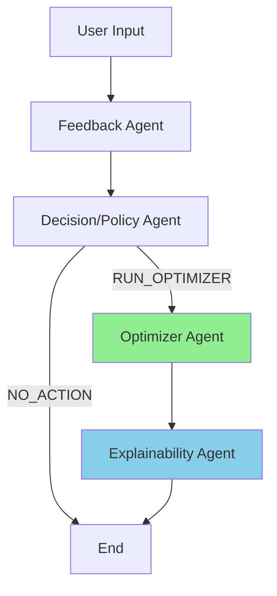
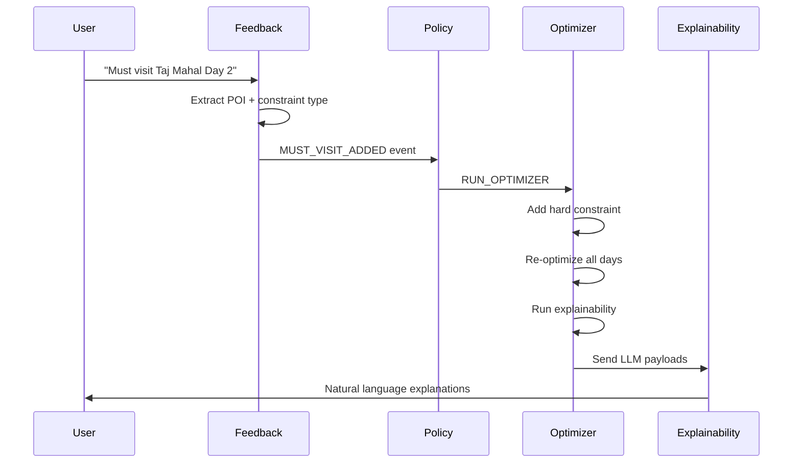
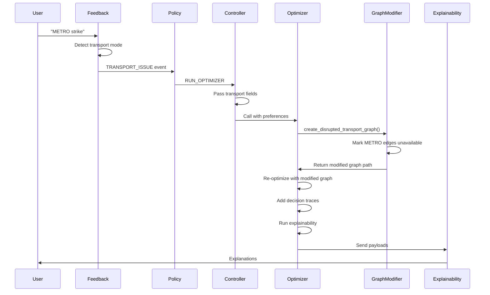
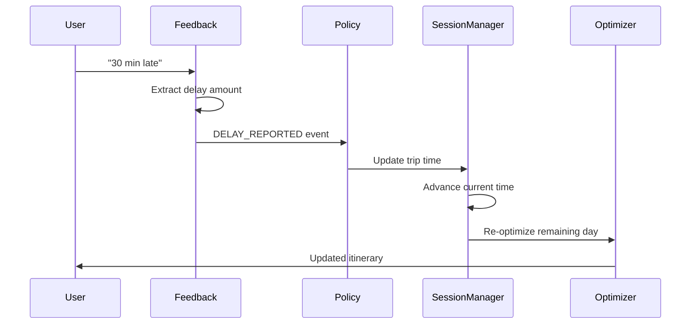
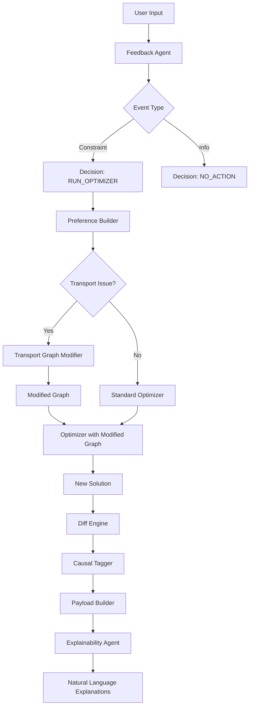
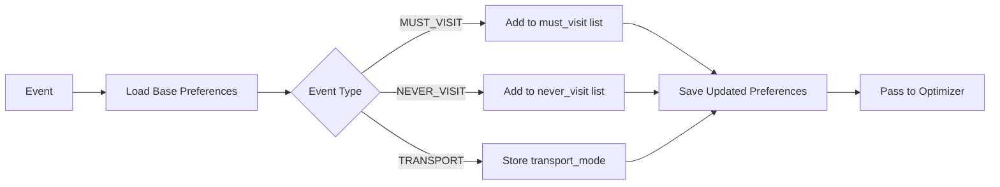

# Agent System Technical Flow Documentation

## Overview

The agent system consists of 5 coordinated agents that process user feedback, make policy decisions, optimize itineraries, and generate natural language explanations. This document details the technical flow for each supported event type.

---

## System Architecture



### Agents

1. **Feedback Agent**: Parses natural language → structured events
2. **Decision/Policy Agent**: Maps events → actions
3. **Optimizer Agent**: Re-optimizes itinerary + runs explainability pipeline
4. **Explainability Agent**: Generates natural language explanations
5. **Agent Controller**: Orchestrates the entire flow

---

## Event Type Flows

### 1. MUST_VISIT_ADDED

**User Input**: *"We must visit the Taj Mahal on Day 2"*

#### Flow



#### Technical Details

**1. Feedback Agent** (`feedback_agent.py`)
- **Detection**: LLM identifies "must visit" intent
- **POI Resolution**: Maps "Taj Mahal" → `LOC_XXX` using `poi_mapper.py`
- **Day Parsing**: Extracts "Day 2" → `target_day: 1` (0-indexed)
- **Output**:
```python
FeedbackEvent(
    event_type=EventType.MUST_VISIT_ADDED,
    confidence=ConfidenceLevel.HIGH,
    poi_id="LOC_XXX",
    poi_name="Taj Mahal",
    target_day=1,  # Day 2 (0-indexed)
    family_id="FAM_A"
)
```

**2. Decision/Policy Agent** (`decision_policy_agent.py`)
- **Logic**: All constraint changes trigger `RUN_OPTIMIZER`
- **Output**:
```python
PolicyDecision(
    action=ActionType.RUN_OPTIMIZER,
    reason="Hard constraint added: must-visit POI",
    requires_approval=False
)
```

**3. Agent Controller** (`agent_controller.py`)
- **Preferences Building** (lines 84-92):
```python
preferences = {
    "event_type": EventType.MUST_VISIT_ADDED,
    "family_id": "FAM_A",
    "poi_name": "Taj Mahal",
    "poi_id": "LOC_XXX"
}
```

**4. Optimizer Agent** (`optimizer_agent.py`)
- **Preference Builder** (lines 60-80):
  - Loads base preferences
  - Applies event using `apply_event_to_preferences()`
  - Adds to `must_visit` list for family
- **Optimizer Execution** (lines 240-260):
  - Full trip re-optimization
  - CP-SAT solver respects hard constraints
- **Explainability Pipeline** (lines 290-320):
  - Diff engine compares baseline vs new solution
  - Causal tagger tags changes
  - Payload builder creates LLM inputs
  - Saves `enriched_diffs.json`, `llm_payloads.json`

**5. Explainability Agent** (`explainability_agent.py`)
- **LLM Call**: Sends each payload to Groq
- **Output**: *"Added Taj Mahal to FAM_A's Day 2 itinerary to satisfy your must-visit preference."*

#### Causal Tags
- `USER_CONSTRAINT_APPLIED`
- `MUST_VISIT_ENFORCED`
- `OPTIMIZER_SELECTED` (for other changes triggered by constraint)

---

### 2. NEVER_VISIT_ADDED

**User Input**: *"Please skip the Red Fort, we're not interested"*

#### Flow

Similar to MUST_VISIT but adds exclusion constraint.

#### Technical Details

**Feedback Agent**
```python
FeedbackEvent(
    event_type=EventType.NEVER_VISIT_ADDED,
    poi_id="LOC_001",  # Red Fort
    poi_name="Red Fort",
    confidence=ConfidenceLevel.HIGH
)
```

**Preference Builder**
- Adds to `never_visit` list
- Solver excludes POI from all solutions

**Diff Engine**
- Detects POI removal
- Type: `POI_REMOVED`

**Causal Tagger Logic**
```python
# causal_tagger.py lines 80-96
if change["type"] == "POI_REMOVED":
    # Check if in trace constraints
    if poi_id in trace.get("never_visit", []):
        tags.append("USER_EXCLUSION_ENFORCED")
    else:
        tags.append("OBJECTIVE_DOMINATED")
```

**Expected Output**:
*"Removed Red Fort from FAM_B's Day 1 because you excluded it. Saved 43 INR in costs."*

#### Causal Tags
- `USER_EXCLUSION_ENFORCED`
- `OBJECTIVE_DOMINATED` (if removed for other reasons)

---

### 3. TRANSPORT_ISSUE (Transport Disruption)

**User Input**: *"There's a METRO strike today, all metro services are unavailable"*

#### Flow



#### Technical Details

**1. Feedback Agent** (`feedback_agent.py` lines 160-180)
- **Transport Mode Extraction**:
```python
transport_mode = None
if "metro" in user_lower:
    transport_mode = "METRO"
elif "bus" in user_lower:
    transport_mode = "BUS"
# ... etc
```

- **Output**:
```python
FeedbackEvent(
    event_type=EventType.TRANSPORT_ISSUE,
    transport_mode="METRO",
    disruption_from_poi=None,  # Global disruption
    disruption_to_poi=None,
    confidence=ConfidenceLevel.HIGH
)
```

**2. Agent Controller** (`agent_controller.py` lines 84-92)
- **Critical Fix**: Pass transport fields to optimizer
```python
preferences = {
    "event_type": EventType.TRANSPORT_ISSUE,
    # ... other fields ...
    "transport_mode": getattr(event, 'transport_mode', None),  # ✅ CRITICAL
    "disruption_from_poi": getattr(event, 'disruption_from_poi', None),
    "disruption_to_poi": getattr(event, 'disruption_to_poi', None)
}
```

**3. Optimizer Agent** (`optimizer_agent.py`)

**Event Type Check** (lines 226-242):
```python
event_type_str = str(preferences.get('event_type', ''))
if 'TRANSPORT_ISSUE' in event_type_str:
    transport_mode = preferences.get('transport_mode')
    from_poi = preferences.get('disruption_from_poi')
    to_poi = preferences.get('disruption_to_poi')
    
    if transport_mode:
        transport_file_to_use = create_disrupted_transport_graph(
            transport_graph_path=str(self.transport_path),
            transport_mode=transport_mode,
            from_poi=from_poi,
            to_poi=to_poi,
            output_dir=str(run_dir)
        )
        transport_disruption_active = True
```

**Transport Graph Modification** (`transport_graph_modifier.py`):
```python
# Global METRO disruption
for edge in graph:
    if edge.get("mode") == "METRO":
        edge["available"] = False  # Mark unavailable
        edge["disruption_reason"] = "USER_REPORTED"
```

**Decision Traces** (lines 327-344):
```python
if transport_disruption_active:
    for day_idx in range(len(new_solution['days'])):
        decision_traces[day_idx] = {
            "candidates": [],
            "constraints": [],
            "active_disruptions": [{
                "disruption_id": "METRO_DISRUPTION",
                "affected_modes": ["METRO"],
                "reason": "USER_REPORTED",
                "severity": "SEVERE"
            }]
        }
```

**4. Causal Tagger** (`causal_tagger.py` lines 98-124)
```python
elif c_type == "ROUTE_CHANGED":
    if trace.get("active_disruptions"):
        for disruption in trace["active_disruptions"]:
            if from_mode in disruption["affected_modes"]:
                tags.append("TRANSPORT_DISRUPTED")
                tags.append(f"{from_mode}_UNAVAILABLE")
                tags.append("ROUTE_REROUTED")
                tags.append(f"REROUTED_TO_{to_mode}")
```

#### Current Limitation

The diff engine doesn't generate `ROUTE_CHANGED` diffs yet. It only detects POI additions/removals. Transport mode changes are implicit in the solution but not explicitly tagged.

**To Enable Transport Tags**:
Need to enhance `diff_engine.py` to:
1. Compare transport segments between solutions
2. Detect mode changes (METRO → BUS)
3. Generate `ROUTE_CHANGED` type diffs

#### Causal Tags (When Fully Implemented)
- `TRANSPORT_DISRUPTED`
- `METRO_UNAVAILABLE` (or BUS, AUTO, CAB)
- `ROUTE_REROUTED`
- `REROUTED_TO_BUS` (or other mode)

---

### 4. DAY_RATING (Soft Preference)

**User Input**: *"I'd rate today a 9 out of 10!"*

#### Flow

Simpler flow - updates soft preferences but may not trigger re-optimization immediately.

#### Technical Details

**Feedback Agent**
```python
FeedbackEvent(
    event_type=EventType.DAY_RATING,
    rating=9,
    target_day=current_day,
    confidence=ConfidenceLevel.MEDIUM
)
```

**Policy Agent**
- **Logic**: Soft preferences accumulate
- **Action**: `NO_ACTION` (or queue for next optimization)

**Future Enhancement**:
- Store ratings
- Use for reinforcement learning
- Adjust satisfaction weights

---

### 5. DELAY_REPORTED

**User Input**: *"We're running 30 minutes late due to traffic"*

#### Flow



#### Technical Details

**Feedback Agent**
```python
FeedbackEvent(
    event_type=EventType.DELAY_REPORTED,
    delay_minutes=30,
    confidence=ConfidenceLevel.HIGH
)
```

**Policy Agent** (Future Implementation)
```python
if event.event_type == EventType.DELAY_REPORTED:
    # Update session state
    session_manager.update_trip_time(
        trip_id=trip_id,
        delay_minutes=event.delay_minutes
    )
    
    # Re-optimize remaining day
    return PolicyDecision(
        action=ActionType.RUN_OPTIMIZER,
        reason="Time delay requires schedule adjustment",
        target_scope="current_day_remaining"
    )
```

**Optimizer**
- Uses `reoptimize_from_current_state()`
- Only re-optimizes future POIs on current day
- Preserves completed visits

---

## Data Flow Diagrams

### Full System Flow



### Preference Application Flow



---

## File Structure

```
agents/
├── agent_controller.py      # Orchestration
├── feedback_agent.py         # NL → Events
├── decision_policy_agent.py  # Events → Actions
├── optimizer_agent.py        # Optimization + Explainability
├── explainability_agent.py   # LLM explanations
├── transport_graph_modifier.py  # Transport disruption utility
├── preference_builder.py     # Preference management
├── poi_mapper.py             # POI name resolution
└── schemas.py                # Data structures

ml_or/explainability/
├── diff_engine.py            # Solution comparison
├── causal_tagger.py          # Tag assignment
├── delta_engine.py           # Cost calculations
└── payload_builder.py        # LLM input construction
```

---

## Key Design Patterns

### 1. Event-Driven Architecture
- Feedback agent emits events
- Policy agent routes events
- Optimizer reacts to events

### 2. Separation of Concerns
- **Parsing**: Feedback agent only
- **Decision**: Policy agent only
- **Execution**: Optimizer agent only
- **Explanation**: Explainability agent only

### 3. Preference Accumulation
- Base preferences always preserved
- Events add/modify constraints
- Cumulative across session

### 4. Explainability Pipeline
```
Solution Diff → Causal Tags → LLM Payloads → Natural Language
```

---

## Configuration

### LLM Settings (`config.py`)
```python
DEFAULT_LLM_MODEL = "llama-3.3-70b-versatile"
DEFAULT_TEMPERATURE = 0.1
DEFAULT_MAX_TOKENS = 500
```

### Optimizer Settings
- Solver: Google OR-Tools CP-SAT
- Timeout: Default 30 seconds per day
- Output: JSON format

---

## Error Handling

### LLM Rate Limiting
```python
# run_demo.py - 10 second pause between scenarios
if i > 1:
    print(f"⏳ Pausing 10 seconds to avoid rate limiting...")
    time.sleep(10)
```

### Validation Errors
- Events validated against schemas
- Confidence thresholds enforced
- Fallback to NO_ACTION on low confidence

---

## Future Enhancements

### 1. Transport Causal Tags
- Enhance diff engine for route change detection
- Generate `ROUTE_CHANGED` diffs
- Enable full transport disruption tagging

### 2. Mid-Trip Re-optimization
- Session state management
- Time-aware constraints
- Partial day re-optimization

### 3. Multi-Event Batching
- Accumulate related events
- Optimize once for batch
- Reduce API calls

### 4. Preference Learning
- Store user ratings
- Adjust satisfaction weights
- Personalized recommendations

---

## Testing

### Demo Runner (`run_demo.py`)
```python
scenarios = [
    {"name": "Must-Visit Added", "input": "...", "context": {...}},
    {"name": "Location Excluded", "input": "...", "context": {...}},
    {"name": "METRO Disruption", "input": "...", "context": {...}},
    # ...
]
```

### Verification
1. **Event Detection**: Check `event_type` correctness
2. **Policy Decision**: Verify `RUN_OPTIMIZER` vs `NO_ACTION`
3. **Optimizer Output**: Validate solution respects constraints
4. **Causal Tags**: Confirm appropriate tags applied
5. **Explanations**: Review natural language quality

---

## Troubleshooting

### Common Issues

**1. Transport Disruption Not Applied**
- **Symptom**: METRO routes still in solution
- **Cause**: Transport fields not passed to optimizer
- **Fix**: Verify `agent_controller.py` lines 84-92

**2. No Explanations Generated**
- **Symptom**: Empty `llm_outputs.json`
- **Cause**: No payload generation or zero diffs
- **Fix**: Check `llm_payloads.json` for payloads

**3. POI Not Resolved**
- **Symptom**: `poi_id: null` in event
- **Cause**: Name not in locations.json
- **Fix**: Add fuzzy matching or update data

**4. Groq Rate Limiting**
- **Symptom**: 429 errors
- **Cause**: Too many API calls
- **Fix**: Add delays between scenarios

---

## Performance Metrics

### Typical Execution Times
- Feedback Agent: ~500ms (LLM call)
- Decision Agent: <1ms (rule-based)
- Optimizer Agent: 1-5s (CP-SAT solve)
- Explainability: ~2s (LLM call per change)

### Total End-to-End
- Single scenario: ~5-10 seconds
- Full demo (5 scenarios): ~60 seconds (with rate limiting pauses)

---

## References

- [AGENT_ARCHITECTURE.md](./AGENT_ARCHITECTURE.md) - System design
- [OPTIMIZER_INTEGRATION.md](./OPTIMIZER_INTEGRATION.md) - ML/OR integration
- [AGENT_API_REFERENCE.md](./AGENT_API_REFERENCE.md) - API documentation
- [Google OR-Tools](https://developers.google.com/optimization) - CP-SAT solver
- [Groq API](https://console.groq.com) - LLM provider
