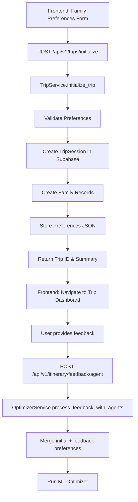

# Initial Family Preference Setup - Design Document

> **Design for capturing and storing initial family preferences before trip optimization**

**Problem Statement**: We need a way to capture detailed family preferences (interest vectors, constraints, must/never visit) from the frontend during trip planning and store them efficiently in the database before the first optimization run.

---

## System Overview



---

## API Design

### Endpoint: Initialize Trip with Preferences

```
POST /api/v1/trips/initialize
```

**Purpose**: Create a new trip with initial family preferences

**Request Schema**:

```typescript
interface InitializeTripRequest {
  trip_name: string;
  destination: string;
  start_date: string;          // ISO 8601
  end_date: string;            // ISO 8601
  baseline_itinerary: string;  // Path or ID to skeleton itinerary
  families: FamilyPreference[];
}

interface FamilyPreference {
  family_id: string;           // "FAM_A", "FAM_B", etc.
  family_name?: string;        // "Smith Family"
  members: number;             // Total members
  children: number;            // Number of children
  budget_sensitivity: number;  // 0.0-1.0 (1.0 = very budget conscious)
  energy_level: number;        // 0.0-1.0 (1.0 = very energetic)
  pace_preference: "relaxed" | "moderate" | "fast";
  
  // Interest vector (0.0-1.0 for each category)
  interest_vector: {
    history: number;
    architecture: number;
    food: number;
    nature: number;
    nightlife: number;
    shopping: number;
    religious: number;
    adventure?: number;
    culture?: number;
  };
  
  // Initial constraints
  must_visit_locations: string[];   // ["LOC_006", "LOC_010"]
  never_visit_locations: string[];  // ["LOC_001"]
  
  // Optional metadata
  notes?: string;
  dietary_restrictions?: string[];
  accessibility_needs?: string[];
}
```

**Response Schema**:

```typescript
interface InitializeTripResponse {
  success: boolean;
  trip_id: string;
  trip_session_id: string;      // UUID from database
  message: string;
  summary: {
    families_registered: number;
    total_members: number;
    total_children: number;
    trip_duration_days: number;
    baseline_itinerary: string;
  };
  next_steps: string[];          // Guidance for user
}
```

**Example Request**:

```json
{
  "trip_name": "Delhi Grand Tour",
  "destination": "Delhi, India",
  "start_date": "2026-03-15",
  "end_date": "2026-03-18",
  "baseline_itinerary": "delhi_3day_skeleton",
  "families": [
    {
      "family_id": "FAM_A",
      "family_name": "Smith Family",
      "members": 4,
      "children": 2,
      "budget_sensitivity": 0.9,
      "energy_level": 0.6,
      "pace_preference": "relaxed",
      "interest_vector": {
        "history": 0.9,
        "architecture": 0.8,
        "food": 0.4,
        "nature": 0.5,
        "nightlife": 0.1,
        "shopping": 0.3,
        "religious": 0.9
      },
      "must_visit_locations": ["LOC_008", "LOC_016"],
      "never_visit_locations": ["LOC_001"],
      "notes": "Budget sensitive. History buffs. HATES Red Fort.",
      "dietary_restrictions": ["vegetarian"],
      "accessibility_needs": []
    },
    {
      "family_id": "FAM_B",
      "family_name": "Johnson Family",
      "members": 2,
      "children": 0,
      "budget_sensitivity": 0.2,
      "energy_level": 0.9,
      "pace_preference": "fast",
      "interest_vector": {
        "history": 0.3,
        "architecture": 0.5,
        "food": 0.9,
        "nature": 0.2,
        "nightlife": 1.0,
        "shopping": 0.8,
        "religious": 0.1
      },
      "must_visit_locations": ["LOC_001"],
      "never_visit_locations": ["LOC_006"],
      "notes": "Loves nightlife and food. Young couple.",
      "dietary_restrictions": [],
      "accessibility_needs": []
    }
  ]
}
```

**Example Response**:

```json
{
  "success": true,
  "trip_id": "delhi_001",
  "trip_session_id": "550e8400-e29b-41d4-a716-446655440000",
  "message": "Trip initialized successfully with 2 families",
  "summary": {
    "families_registered": 2,
    "total_members": 6,
    "total_children": 2,
    "trip_duration_days": 3,
    "baseline_itinerary": "delhi_3day_skeleton"
  },
  "next_steps": [
    "Review your baseline itinerary",
    "Run initial optimization to see the proposed trip plan",
    "Provide feedback to refine the itinerary"
  ]
}
```

---

## Database Schema Updates

### Enhanced TripSession Model

```python
# backend/app/models/trip_session.py

from sqlmodel import Field, Column, JSON
from typing import Dict, List, Any, Optional
from uuid import UUID, uuid4
from datetime import datetime

class TripSession(SQLModel, table=True):
    __tablename__ = "trip_sessions"
    
    # Primary identification
    id: UUID = Field(default_factory=uuid4, primary_key=True)
    trip_id: str = Field(unique=True, index=True)
    trip_name: Optional[str] = None
    
    # Trip details
    destination: Optional[str] = None
    start_date: Optional[datetime] = None
    end_date: Optional[datetime] = None
    
    # Family information
    family_ids: List[str] = Field(sa_column=Column(JSON))
    
    # Itinerary paths
    baseline_itinerary_path: str
    latest_itinerary_path: Optional[str] = None
    
    # Storage directories
    session_storage_dir: str
    output_dir: str
    
    # Preferences (ENHANCED - stores initial + accumulated)
    initial_preferences: Dict[str, Any] = Field(
        default_factory=dict,
        sa_column=Column(JSON),
        description="Initial preferences from trip setup"
    )
    
    current_preferences: Dict[str, Any] = Field(
        default_factory=dict,
        sa_column=Column(JSON),
        description="Current preferences (initial + feedback updates)"
    )
    
    # Feedback history
    feedback_history: List[Dict[str, Any]] = Field(
        default_factory=list,
        sa_column=Column(JSON)
    )
    
    # Optimization tracking
    iteration_count: int = Field(default=0)
    last_optimization_at: Optional[datetime] = None
    
    # Timestamps
    created_at: datetime = Field(default_factory=datetime.utcnow)
    updated_at: datetime = Field(default_factory=datetime.utcnow)
```

### New Family Model (Optional - for detailed tracking)

```python
# backend/app/models/family.py

from sqlmodel import SQLModel, Field, Column, JSON
from typing import Dict, List, Optional, Any
from uuid import UUID, uuid4
from datetime import datetime

class FamilyProfile(SQLModel, table=True):
    __tablename__ = "family_profiles"
    
    id: UUID = Field(default_factory=uuid4, primary_key=True)
    family_id: str = Field(unique=True, index=True)
    family_name: Optional[str] = None
    
    # Demographics
    members: int
    children: int
    
    # Preferences
    budget_sensitivity: float  # 0.0-1.0
    energy_level: float        # 0.0-1.0
    pace_preference: str       # "relaxed" | "moderate" | "fast"
    
    # Interest vector
    interest_vector: Dict[str, float] = Field(sa_column=Column(JSON))
    
    # Constraints
    must_visit_locations: List[str] = Field(default_factory=list, sa_column=Column(JSON))
    never_visit_locations: List[str] = Field(default_factory=list, sa_column=Column(JSON))
    
    # Metadata
    notes: Optional[str] = None
    dietary_restrictions: List[str] = Field(default_factory=list, sa_column=Column(JSON))
    accessibility_needs: List[str] = Field(default_factory=list, sa_column=Column(JSON))
    
    # Timestamps
    created_at: datetime = Field(default_factory=datetime.utcnow)
    updated_at: datetime = Field(default_factory=datetime.utcnow)
```

---

## Backend Implementation

### 1. Create TripService

```python
# backend/app/services/trip_service.py

import logging
from typing import Dict, List, Any, Optional
from pathlib import Path
from datetime import datetime
from uuid import UUID

from app.models.trip_session import TripSession
from app.models.family import FamilyProfile
from app.services.optimizer_service import OptimizerService, get_db_session
from app.core.config import settings

logger = logging.getLogger(__name__)

class TripService:
    """
    Service for managing trip initialization and family preferences.
    """
    
    @staticmethod
    def initialize_trip(
        trip_name: str,
        destination: str,
        start_date: str,
        end_date: str,
        baseline_itinerary: str,
        families: List[Dict[str, Any]]
    ) -> Dict[str, Any]:
        """
        Initialize a new trip with family preferences.
        
        Args:
            trip_name: Human-readable trip name
            destination: Trip destination
            start_date: ISO 8601 date string
            end_date: ISO 8601 date string
            baseline_itinerary: Path to skeleton itinerary
            families: List of family preference dictionaries
            
        Returns:
            Dictionary with trip_id, summary, and next steps
        """
        logger.info(f"Initializing trip: {trip_name}")
        
        # Generate trip ID
        trip_id = TripService._generate_trip_id(destination, start_date)
        
        # Validate preferences
        TripService._validate_preferences(families)
        
        # Extract family IDs
        family_ids = [f["family_id"] for f in families]
        
        # Convert preferences to optimizer format
        initial_preferences = TripService._convert_to_optimizer_format(families)
        
        # Map baseline itinerary name to path
        baseline_path = TripService._resolve_baseline_path(baseline_itinerary)
        
        # Create trip session
        trip_session = OptimizerService.create_trip_session(
            trip_id=trip_id,
            family_ids=family_ids,
            baseline_itinerary_path=baseline_path,
            trip_name=trip_name
        )
        
        # Update with additional details
        trip_session.destination = destination
        trip_session.start_date = datetime.fromisoformat(start_date)
        trip_session.end_date = datetime.fromisoformat(end_date)
        trip_session.initial_preferences = initial_preferences
        trip_session.current_preferences = initial_preferences.copy()
        
        # Save to database
        OptimizerService.update_trip_session(trip_session)
        
        # Optionally create family profiles
        for family_data in families:
            TripService._create_family_profile(family_data)
        
        # Calculate trip duration
        start = datetime.fromisoformat(start_date)
        end = datetime.fromisoformat(end_date)
        duration_days = (end - start).days
        
        # Calculate totals
        total_members = sum(f["members"] for f in families)
        total_children = sum(f["children"] for f in families)
        
        logger.info(f"Trip initialized: {trip_id} with {len(families)} families")
        
        return {
            "success": True,
            "trip_id": trip_id,
            "trip_session_id": str(trip_session.id),
            "message": f"Trip initialized successfully with {len(families)} families",
            "summary": {
                "families_registered": len(families),
                "total_members": total_members,
                "total_children": total_children,
                "trip_duration_days": duration_days,
                "baseline_itinerary": baseline_itinerary
            },
            "next_steps": [
                "Review your baseline itinerary",
                "Run initial optimization to see the proposed trip plan",
                "Provide feedback to refine the itinerary"
            ]
        }
    
    @staticmethod
    def _generate_trip_id(destination: str, start_date: str) -> str:
        """Generate a unique trip ID."""
        dest_code = destination.lower().replace(" ", "_").replace(",", "")[:10]
        date_code = start_date.replace("-", "")[:8]
        import random
        random_code = f"{random.randint(1000, 9999)}"
        return f"{dest_code}_{date_code}_{random_code}"
    
    @staticmethod
    def _validate_preferences(families: List[Dict[str, Any]]) -> None:
        """
        Validate family preferences.
        
        Raises:
            ValueError: If preferences are invalid
        """
        for family in families:
            # Check required fields
            required = ["family_id", "members", "interest_vector"]
            for field in required:
                if field not in family:
                    raise ValueError(f"Missing required field: {field}")
            
            # Validate ranges
            if "budget_sensitivity" in family:
                if not 0.0 <= family["budget_sensitivity"] <= 1.0:
                    raise ValueError("budget_sensitivity must be in [0.0, 1.0]")
            
            if "energy_level" in family:
                if not 0.0 <= family["energy_level"] <= 1.0:
                    raise ValueError("energy_level must be in [0.0, 1.0]")
            
            # Validate interest vector
            for category, value in family["interest_vector"].items():
                if not 0.0 <= value <= 1.0:
                    raise ValueError(f"Interest vector {category} must be in [0.0, 1.0]")
            
            # Check for conflicts
            must_visit = set(family.get("must_visit_locations", []))
            never_visit = set(family.get("never_visit_locations", []))
            overlap = must_visit & never_visit
            if overlap:
                raise ValueError(
                    f"Conflicting preferences for {family['family_id']}: "
                    f"{overlap} in both must_visit and never_visit"
                )
    
    @staticmethod
    def _convert_to_optimizer_format(families: List[Dict[str, Any]]) -> Dict[str, Any]:
        """
        Convert frontend format to ML optimizer format.
        
        Returns:
            Dictionary in optimizer's expected format
        """
        optimizer_prefs = {}
        
        for family in families:
            family_id = family["family_id"]
            
            optimizer_prefs[family_id] = {
                "family_id": family_id,
                "members": family.get("members", 1),
                "children": family.get("children", 0),
                "budget_sensitivity": family.get("budget_sensitivity", 0.5),
                "energy_level": family.get("energy_level", 0.5),
                "pace_preference": family.get("pace_preference", "moderate"),
                "interest_vector": family["interest_vector"],
                "must_visit_locations": family.get("must_visit_locations", []),
                "never_visit_locations": family.get("never_visit_locations", []),
                "notes": family.get("notes", "")
            }
        
        return optimizer_prefs
    
    @staticmethod
    def _resolve_baseline_path(baseline_name: str) -> str:
        """
        Map baseline itinerary name to file path.
        
        Args:
            baseline_name: Name like "delhi_3day_skeleton"
            
        Returns:
            Full path to baseline file
        """
        baselines = {
            "delhi_3day_skeleton": "ml_or/data/base_itinerary_final.json",
            "delhi_5day": "ml_or/data/delhi_5day_skeleton.json",
            "mumbai_3day": "ml_or/data/mumbai_3day_skeleton.json",
            # Add more as needed
        }
        
        if baseline_name in baselines:
            return baselines[baseline_name]
        
        # Check if it's already a path
        path = Path(baseline_name)
        if path.exists():
            return str(path)
        
        raise ValueError(f"Unknown baseline itinerary: {baseline_name}")
    
    @staticmethod
    def _create_family_profile(family_data: Dict[str, Any]) -> None:
        """Create a FamilyProfile record (optional)."""
        try:
            profile = FamilyProfile(
                family_id=family_data["family_id"],
                family_name=family_data.get("family_name"),
                members=family_data["members"],
                children=family_data.get("children", 0),
                budget_sensitivity=family_data.get("budget_sensitivity", 0.5),
                energy_level=family_data.get("energy_level", 0.5),
                pace_preference=family_data.get("pace_preference", "moderate"),
                interest_vector=family_data["interest_vector"],
                must_visit_locations=family_data.get("must_visit_locations", []),
                never_visit_locations=family_data.get("never_visit_locations", []),
                notes=family_data.get("notes"),
                dietary_restrictions=family_data.get("dietary_restrictions", []),
                accessibility_needs=family_data.get("accessibility_needs", [])
            )
            
            with get_db_session() as db:
                db.add(profile)
                logger.info(f"Family profile created: {profile.family_id}")
        except Exception as e:
            logger.warning(f"Failed to create family profile: {e}")
            # Don't fail the trip creation if profile creation fails
    
    @staticmethod
    def get_trip_summary(trip_id: str) -> Dict[str, Any]:
        """Get a summary of the trip with current preferences."""
        trip_session = OptimizerService.get_trip_session(trip_id)
        
        if not trip_session:
            raise ValueError(f"Trip not found: {trip_id}")
        
        return {
            "trip_id": trip_session.trip_id,
            "trip_name": trip_session.trip_name,
            "destination": trip_session.destination,
            "start_date": trip_session.start_date.isoformat() if trip_session.start_date else None,
            "end_date": trip_session.end_date.isoformat() if trip_session.end_date else None,
            "families": trip_session.family_ids,
            "iteration_count": trip_session.iteration_count,
            "current_preferences": trip_session.current_preferences,
            "feedback_count": len(trip_session.feedback_history)
        }
```

---

### 2. Create API Endpoint

```python
# backend/app/api/trips.py

from fastapi import APIRouter, HTTPException, status
from pydantic import BaseModel, Field
from typing import List, Dict, Any, Optional
from datetime import date

from app.services.trip_service import TripService

router = APIRouter(prefix="/trips", tags=["trips"])

# Request Models
class InterestVector(BaseModel):
    history: float = Field(ge=0.0, le=1.0)
    architecture: float = Field(ge=0.0, le=1.0)
    food: float = Field(ge=0.0, le=1.0)
    nature: float = Field(ge=0.0, le=1.0)
    nightlife: float = Field(ge=0.0, le=1.0)
    shopping: float = Field(ge=0.0, le=1.0)
    religious: float = Field(ge=0.0, le=1.0)
    adventure: Optional[float] = Field(default=0.5, ge=0.0, le=1.0)
    culture: Optional[float] = Field(default=0.5, ge=0.0, le=1.0)

class FamilyPreference(BaseModel):
    family_id: str
    family_name: Optional[str] = None
    members: int = Field(gt=0)
    children: int = Field(ge=0, default=0)
    budget_sensitivity: float = Field(default=0.5, ge=0.0, le=1.0)
    energy_level: float = Field(default=0.5, ge=0.0, le=1.0)
    pace_preference: str = Field(default="moderate", pattern="^(relaxed|moderate|fast)$")
    interest_vector: InterestVector
    must_visit_locations: List[str] = Field(default_factory=list)
    never_visit_locations: List[str] = Field(default_factory=list)
    notes: Optional[str] = None
    dietary_restrictions: List[str] = Field(default_factory=list)
    accessibility_needs: List[str] = Field(default_factory=list)

class InitializeTripRequest(BaseModel):
    trip_name: str = Field(min_length=1, max_length=200)
    destination: str = Field(min_length=1, max_length=100)
    start_date: str  # ISO 8601 format
    end_date: str    # ISO 8601 format
    baseline_itinerary: str
    families: List[FamilyPreference] = Field(min_items=1)

class TripSummary(BaseModel):
    families_registered: int
    total_members: int
    total_children: int
    trip_duration_days: int
    baseline_itinerary: str

class InitializeTripResponse(BaseModel):
    success: bool
    trip_id: str
    trip_session_id: str
    message: str
    summary: TripSummary
    next_steps: List[str]

# Endpoints
@router.post("/initialize", response_model=InitializeTripResponse)
async def initialize_trip(request: InitializeTripRequest):
    """
    Initialize a new trip with family preferences.
    
    This endpoint:
    1. Validates family preferences
    2. Creates a TripSession in the database
    3. Stores initial preferences
    4. Returns trip_id for subsequent operations
    """
    try:
        # Convert Pydantic models to dicts
        families = [f.dict() for f in request.families]
        
        # Initialize trip
        result = TripService.initialize_trip(
            trip_name=request.trip_name,
            destination=request.destination,
            start_date=request.start_date,
            end_date=request.end_date,
            baseline_itinerary=request.baseline_itinerary,
            families=families
        )
        
        return InitializeTripResponse(**result)
        
    except ValueError as e:
        raise HTTPException(
            status_code=status.HTTP_400_BAD_REQUEST,
            detail=str(e)
        )
    except Exception as e:
        raise HTTPException(
            status_code=status.HTTP_500_INTERNAL_SERVER_ERROR,
            detail=f"Failed to initialize trip: {str(e)}"
        )

@router.get("/{trip_id}/summary")
async def get_trip_summary(trip_id: str):
    """Get a summary of the trip including current preferences."""
    try:
        summary = TripService.get_trip_summary(trip_id)
        return summary
    except ValueError as e:
        raise HTTPException(
            status_code=status.HTTP_404_NOT_FOUND,
            detail=str(e)
        )
```

---

### 3. Register Router

```python
# backend/app/main.py

from app.api import trips  # Add this import

app.include_router(trips.router, prefix="/api/v1")
```

---

## Frontend Integration

### 1. Preference Form Component

```typescript
// frontend/components/TripInitializationForm.tsx

interface FamilyPreferenceForm {
  familyId: string;
  familyName: string;
  members: number;
  children: number;
  budgetSensitivity: number;
  energyLevel: number;
  pacePreference: 'relaxed' | 'moderate' | 'fast';
  interestVector: {
    history: number;
    architecture: number;
    food: number;
    nature: number;
    nightlife: number;
    shopping: number;
    religious: number;
  };
  mustVisit: string[];
  neverVisit: string[];
  notes: string;
}

export function TripInitializationForm() {
  const [families, setFamilies] = useState<FamilyPreferenceForm[]>([
    createEmptyFamily('FAM_A')
  ]);
  
  const handleSubmit = async () => {
    const payload = {
      trip_name: tripName,
      destination: destination,
      start_date: startDate,
      end_date: endDate,
      baseline_itinerary: 'delhi_3day_skeleton',
      families: families.map(f => ({
        family_id: f.familyId,
        family_name: f.familyName,
        members: f.members,
        children: f.children,
        budget_sensitivity: f.budgetSensitivity,
        energy_level: f.energyLevel,
        pace_preference: f.pacePreference,
        interest_vector: f.interestVector,
        must_visit_locations: f.mustVisit,
        never_visit_locations: f.neverVisit,
        notes: f.notes
      }))
    };
    
    const response = await fetch('/api/v1/trips/initialize', {
      method: 'POST',
      headers: { 'Content-Type': 'application/json' },
      body: JSON.stringify(payload)
    });
    
    const result = await response.json();
    
    if (result.success) {
      // Navigate to trip dashboard
      router.push(`/trip/${result.trip_id}`);
    }
  };
  
  return (
    <form onSubmit={handleSubmit}>
      {/* Trip details */}
      {/* Family preference forms */}
      {/* Submit button */}
    </form>
  );
}
```

---

## Complete Flow Example

### Step 1: Frontend Submits Initial Preferences

```http
POST /api/v1/trips/initialize

{
  "trip_name": "Delhi Adventure",
  "destination": "Delhi, India",
  "start_date": "2026-03-15",
  "end_date": "2026-03-18",
  "baseline_itinerary": "delhi_3day_skeleton",
  "families": [
    {
      "family_id": "FAM_A",
      "members": 4,
      "interest_vector": {"history": 0.9, ...},
      "must_visit_locations": ["LOC_008"],
      "never_visit_locations": ["LOC_001"]
    }
  ]
}
```

### Step 2: Backend Creates TripSession

```sql
INSERT INTO trip_sessions (
  trip_id, initial_preferences, current_preferences, ...
) VALUES (
  'delhi_20260315_1234',
  '{"FAM_A": {"must_visit_locations": ["LOC_008"], ...}}',
  '{"FAM_A": {"must_visit_locations": ["LOC_008"], ...}}',
  ...
);
```

### Step 3: User Views Initial Itinerary

Frontend displays baseline itinerary with family preferences applied.

### Step 4: User Provides Feedback

```http
POST /api/v1/itinerary/feedback/agent

{
  "trip_id": "delhi_20260315_1234",
  "message": "Add Akshardham Temple"
}
```

### Step 5: Backend Merges Preferences

```python
# OptimizerService merges initial + feedback
initial = trip_session.initial_preferences["FAM_A"]
# {"must_visit_locations": ["LOC_008"], "never_visit_locations": ["LOC_001"]}

# Feedback adds
feedback_update = {"must_visit_locations": ["LOC_006"]}

# Merged
current = {
  "must_visit_locations": ["LOC_008", "LOC_006"],
  "never_visit_locations": ["LOC_001"]
}

trip_session.current_preferences["FAM_A"] = current
```

### Step 6: ML Optimizer Runs with Complete Preferences

```json
{
  "family_id": "FAM_A",
  "interest_vector": {"history": 0.9, ...},
  "must_visit_locations": ["LOC_008", "LOC_006"],
  "never_visit_locations": ["LOC_001"]
}
```

---

## Database Migration

```python
# backend/migrations/add_initial_preferences.py

"""Add initial_preferences and enhance trip_sessions table"""

from alembic import op
import sqlalchemy as sa
from sqlalchemy.dialects.postgresql import JSON

def upgrade():
    # Add new columns
    op.add_column('trip_sessions', sa.Column('destination', sa.String(), nullable=True))
    op.add_column('trip_sessions', sa.Column('start_date', sa.DateTime(), nullable=True))
    op.add_column('trip_sessions', sa.Column('end_date', sa.DateTime(), nullable=True))
    op.add_column('trip_sessions', sa.Column('initial_preferences', JSON, nullable=True))
    
    # Rename preferences to current_preferences
    op.alter_column('trip_sessions', 'preferences', new_column_name='current_preferences')
    
    # Create family_profiles table
    op.create_table(
        'family_profiles',
        sa.Column('id', sa.UUID(), primary_key=True),
        sa.Column('family_id', sa.String(), unique=True, nullable=False),
        sa.Column('family_name', sa.String(), nullable=True),
        sa.Column('members', sa.Integer(), nullable=False),
        sa.Column('children', sa.Integer(), default=0),
        sa.Column('budget_sensitivity', sa.Float()),
        sa.Column('energy_level', sa.Float()),
        sa.Column('pace_preference', sa.String()),
        sa.Column('interest_vector', JSON),
        sa.Column('must_visit_locations', JSON),
        sa.Column('never_visit_locations', JSON),
        sa.Column('notes', sa.Text(), nullable=True),
        sa.Column('dietary_restrictions', JSON),
        sa.Column('accessibility_needs', JSON),
        sa.Column('created_at', sa.DateTime()),
        sa.Column('updated_at', sa.DateTime())
    )
```

---

## Summary

### What This Solves:

✅ **Initial Preference Capture**: Frontend can submit detailed family preferences before optimization  
✅ **Efficient Storage**: Preferences stored in Supabase as JSON (no complex joins needed)  
✅ **Preference Merging**: Initial + feedback preferences are merged correctly  
✅ **Validation**: Strong validation at API and service layers  
✅ **Scalability**: Supports multiple families with different preferences  

### Key Benefits:

1. **Complete Data Flow**: Initial setup → Feedback → Optimization
2. **Type Safety**: Pydantic models ensure data integrity
3. **Flexible**: Easy to add new preference categories
4. **Auditable**: Separates initial vs current preferences for tracking changes

---

**Next Steps**:
1. Implement backend service and API endpoint
2. Create database migration
3. Build frontend preference form
4. Test end-to-end flow
5. Document for frontend team
