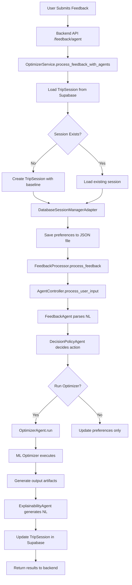
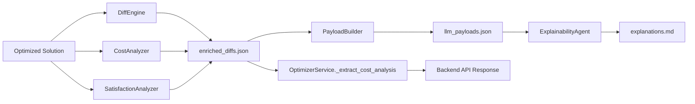
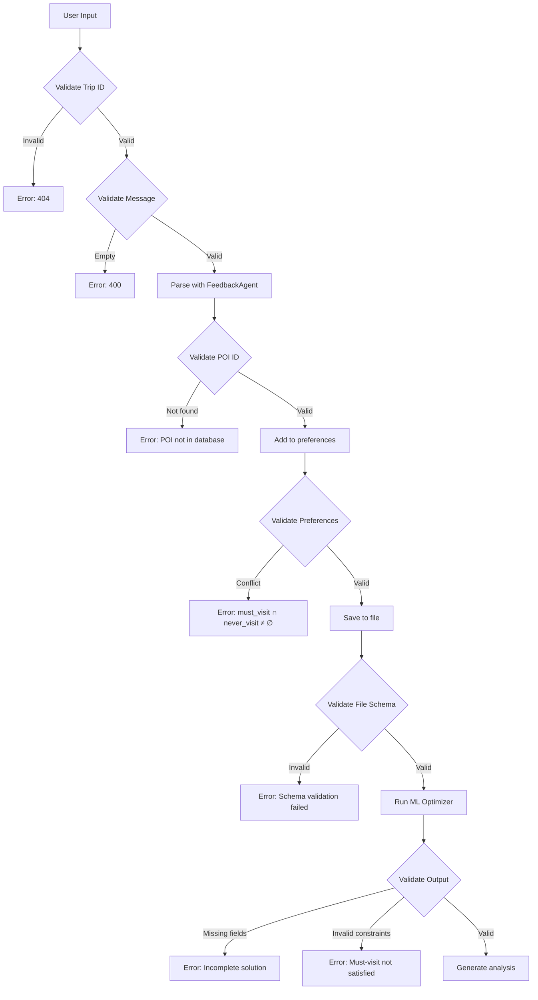

# ML Optimizer Data Flow & Schema Validation Documentation

> **Complete guide to input/output schemas, data validation, and analysis pipeline**

This document explains how data flows from the backend database through agents to the ML optimizer, what schemas are used, how they're validated, and how analysis is performed.

---

## Table of Contents

- [Schema Overview](#schema-overview)
- [Input Schemas](#input-schemas)
- [Backend to Optimizer Data Flow](#backend-to-optimizer-data-flow)
- [ML Optimizer Processing](#ml-optimizer-processing)
- [Output Schemas](#output-schemas)
- [Analysis Pipeline](#analysis-pipeline)
- [Schema Validation](#schema-validation)

---

## Schema Overview

The ML optimizer uses **3 main input schemas** and produces **5 output artifacts**:

### Input Schemas:
1. **`base_itinerary_final.json`** - Skeleton itinerary structure
2. **`family_preferences_3fam_strict.json`** - Family preferences and constraints
3. **`demo_scenario.json`** (optional) - Mid-trip state for re-optimization

### Output Artifacts:
1. **`optimized_solution.json`** - Final optimized itinerary
2. **`enriched_diffs.json`** - Change analysis with cost/satisfaction deltas
3. **`llm_payloads.json`** - Structured data for explanation generation
4. **`decision_traces.json`** - Optimizer decision log
5. **`explanations.md`** - Natural language explanations

---

## Input Schemas

### 1. Base Itinerary Schema

**File**: `ml_or/data/base_itinerary_final.json`

**Purpose**: Defines the skeleton structure of the trip - days, POIs, time windows

**Schema Structure**:

```json
{
  "itinerary_id": "FINAL_DELHI_GRAND_TOUR",
  "city": "Delhi",
  "assumptions": {
    "day_start_time": "09:00",
    "day_end_time": "22:00",
    "max_day_minutes": 780,
    "start_end_location": "LOC_HOTEL",
    "poi_transport_separation": true
  },
  "days": [
    {
      "day": 1,
      "start_location": "LOC_HOTEL",
      "end_location": "LOC_HOTEL",
      "pois": [
        {
          "sequence": 1,
          "location_id": "LOC_008",
          "role": "SKELETON | BRANCH",
          "planned_visit_time_min": 45,
          "time_window_start": "12:30",  // Optional
          "time_window_end": "14:00",    // Optional
          "comment": "Raj Ghat (Shared - Morning)"
        }
      ]
    }
  ]
}
```

**Key Fields**:
- `role`: `SKELETON` (shared by all families) or `BRANCH` (optional, family-specific)
- `time_window_start/end`: Hard constraints for meals, etc.
- `location_id`: References entries in `locations.json`

**Validation Rules**:
- ✅ `day_start_time` < `day_end_time`
- ✅ All `location_id` exist in `locations.json`
- ✅ Time windows don't overlap
- ✅ Sequence numbers are unique per day

---

### 2. Family Preferences Schema

**File**: `ml_or/data/family_preferences_3fam_strict.json`

**Purpose**: Defines family-specific preferences, constraints, and interests

**Schema Structure**:

```json
[
  {
    "family_id": "FAM_A",
    "members": 4,
    "children": 2,
    "budget_sensitivity": 0.9,        // 0.0-1.0 (higher = more cost-conscious)
    "energy_level": 0.6,              // 0.0-1.0 (affects pace)
    "pace_preference": "relaxed",     // "relaxed" | "moderate" | "fast"
    "interest_vector": {
      "history": 0.9,                 // 0.0-1.0 per category
      "architecture": 0.8,
      "food": 0.4,
      "nature": 0.5,
      "nightlife": 0.1,
      "shopping": 0.3,
      "religious": 0.9
    },
    "must_visit_locations": [          // Hard constraints
      "LOC_008",
      "LOC_016"
    ],
    "never_visit_locations": [         // Hard constraints
      "LOC_001"
    ],
    "notes": "Budget sensitive. History buff. HATES Red Fort. LOVES Akshardham."
  }
]
```

**Key Fields**:
- `must_visit_locations`: **Hard constraints** - optimizer MUST include these
- `never_visit_locations`: **Hard constraints** - optimizer MUST exclude these
- `interest_vector`: Soft preferences for POI categories
- `budget_sensitivity`: Weight for cost optimization

**Validation Rules**:
- ✅ All values in 0.0-1.0 range where applicable
- ✅ `must_visit` and `never_visit` don't overlap
- ✅ All location IDs exist in `locations.json`
- ✅ Pace preference is valid enum value

---

### 3. Re-optimization Scenario Schema (Optional)

**File**: `ml_or/data/demo_scenario.json`

**Purpose**: Mid-trip state for re-optimization (used when user changes preferences during trip)

**Schema Structure**:

```json
{
  "day_index": 0,                    // Current day (0-indexed)
  "current_state": {
    "FAM_A": {
      "loc": "LOC_LUNCH",            // Current location
      "time": "13:00"                // Current time
    }
  },
  "visited_history": {
    "FAM_A": [
      "LOC_001",                     // Already visited POIs
      "LOC_008"
    ]
  },
  "user_requests": {                 // New preferences added mid-trip
    "FAM_A": {
      "force_visit": ["LOC_004"],    // Must add to remaining days
      "force_skip": []               // Must remove from remaining days
    }
  }
}
```

**Used When**: User submits feedback like "Add Akshardham" during the trip

---

## Backend to Optimizer Data Flow

### Step-by-Step Flow:



### Data Transformation at Each Stage:

#### Stage 1: User Feedback → Database
```python
# User input
POST /api/v1/itinerary/feedback/agent
{
  "message": "We loved Akshardham!",
  "trip_id": "delhi_001"
}

# Stored in TripSession (Supabase)
{
  "trip_id": "delhi_001",
  "preferences": {},              # Empty initially
  "feedback_history": [],
  "iteration_count": 0
}
```

#### Stage 2: Database → Agent Processing
```python
# OptimizerService loads session
trip_session = get_trip_session("delhi_001")

# DatabaseSessionManagerAdapter converts to file
# Saves: ./trip_sessions/delhi_001/preferences_input.json
{
  "FAM_A": {
    "must_visit": [],
    "never_visit": [],
    "ratings": {}
  }
}
```

#### Stage 3: Agent NL Parsing
```python
# FeedbackAgent parses natural language
Input: "We loved Akshardham!"

# Output: Structured event
{
  "event_type": "MUST_VISIT_ADDED",
  "poi_name": "Akshardham",
  "poi_id": "LOC_006",
  "family_id": "FAM_A",
  "confidence": 0.95
}
```

#### Stage 4: Update Preferences
```python
# DecisionPolicyAgent adds to must_visit
{
  "FAM_A": {
    "must_visit": ["LOC_006"],     # Akshardham added
    "never_visit": [],
    "ratings": {}
  }
}
```

#### Stage 5: Prepare Optimizer Input
```python
# OptimizerAgent merges with baseline preferences
# Input: base preferences + user additions
{
  "family_id": "FAM_A",
  "members": 4,
  "children": 2,
  "budget_sensitivity": 0.9,
  "interest_vector": {
    "history": 0.9,
    "architecture": 0.8,
    ...
  },
  "must_visit_locations": ["LOC_006"],  # User's addition
  "never_visit_locations": []
}

# Saved to: ./optimizer_outputs/delhi_001/iteration_1/preferences_input.json
```

---

## ML Optimizer Processing

### Internal Flow:

```python
# 1. Load inputs
skeleton = load_json("base_itinerary_final.json")
preferences = load_json("preferences_input.json")
locations = load_json("locations.json")
transport_graph = load_json("transport_graph.json")

# 2. Build optimization model
from ml_or.itinerary_optimizer import ItineraryOptimizer
optimizer = ItineraryOptimizer(
     skeleton=skeleton,
    preferences=preferences,
    locations=locations,
    transport=transport_graph
)

# 3. Add constraints
# Hard constraints from must_visit/never_visit
for poi in preferences["FAM_A"]["must_visit"]:
    optimizer.add_constraint(f"family_FAM_A_visits_{poi} == 1")

for poi in preferences["FAM_A"]["never_visit"]:
    optimizer.add_constraint(f"family_FAM_A_visits_{poi} == 0")

# 4. Set objective function
# Maximize: Σ(satisfaction_score * visit_duration) - λ * cost
optimizer.set_objective(
    maximize=sum(
        satisfaction[poi] * duration[poi] * visited[poi]
        for poi in all_pois
    ) - budget_weight * total_cost
)

# 5. Solve
solution = optimizer.solve(time_limit=10)  # 10 seconds max

# 6. Return optimized itinerary
return solution
```

### Constraint Validation:

**Before Optimization**:
```json
{
  "must_visit": ["LOC_006"],     // Akshardham
  "never_visit": ["LOC_001"]     // Red Fort
}
```

**After Optimization** (verification):
```json
{
  "FAM_A": {
    "pois": [
      {"location_id": "LOC_006", ...},  // ✅ Akshardham included
      // ❌ LOC_001 (Red Fort) NOT present
      {"location_id": "LOC_003", ...}
    ]
  }
}
```

---

## Output Schemas

### 1. Optimized Solution

**File**: `optimized_solution.json`

**Structure**:

```json
{
  "trip_id": "FINAL_DELHI_GRAND_TOUR",
  "families": ["FAM_A", "FAM_B", "FAM_C"],
  "days": [
    {
      "day": 1,
      "objective_value": -455.0,           // Optimization score
      "solve_time_seconds": 0.38,
      "shared_poi_order": [                // Synchronization points
        "LOC_008",
        "LOC_LUNCH",
        "LOC_001",
        "LOC_010",
        "LOC_DINNER"
      ],
      "total_transport_cost": 489,
      "total_transport_time_min": 454,
      "families": {
        "FAM_A": {
          "family_id": "FAM_A",
          "total_satisfaction": 9.29,       // Aggregate satisfaction
          "pois": [
            {
              "sequence": 1,
              "location_id": "LOC_008",
              "location_name": "Raj Ghat 8",
              "arrival_time": "09:31",
              "departure_time": "10:16",
              "visit_duration_min": 45,
              "satisfaction_score": 1.44    // Personalized score
            }
          ],
          "transport": [
            {
              "from": "LOC_008",
              "from_name": "Raj Ghat 8",
              "to": "LOC_LUNCH",
              "to_name": "Connaught Place Restaurants",
              "mode": "BUS",
              "duration_min": 32,
              "cost": 33
            }
          ]
        }
      }
    }
  ]
}
```

**Key Metrics**:
- `objective_value`: Optimizer's fitness score (higher = better)
- `solve_time_seconds`: How long optimization took
- `total_satisfaction`: Sum of all POI satisfaction scores
- `total_transport_cost`: Total travel cost for the day

---

### 2. Enriched Diffs (Change Analysis)

**File**: `enriched_diffs.json`

**Purpose**: Detailed comparison between baseline and optimized itinerary

**Structure**:

```json
{
  "FAM_A": {
    "1": [                          // Day 1 changes
      {
        "type": "POI_REMOVED",
        "poi": "LOC_013",           // Lodhi Garden removed
        "causal_tags": [
          "OBJECTIVE_DOMINATED"     // Reason: better alternatives exist
        ],
        "satisfaction_delta": {
          "loss": 0.0               // No satisfaction loss
        },
        "cost_delta": {
          "saved_cost": 105.26,     // Saved ₹105.26
          "currency": "INR",
          "transport_savings": 105.26
        }
      },
      {
        "type": "POI_ADDED",
       "poi": "LOC_006",           // Akshardham added
        "causal_tags": [
          "USER_MUST_VISIT"         // Reason: user requested
        ],
        "satisfaction_delta": {
          "gain": 1.8                // +1.8 satisfaction
        },
        "cost_delta": {
          "added_cost": 150.0,       // Costs ₹150
          "currency": "INR",
          "transport_cost": 50.0,
          "entry_fee": 100.0
        }
      }
    ]
  }
}
```

**Change Types**:
- `POI_ADDED`: New POI included
- `POI_REMOVED`: POI excluded
- `POI_MOVED`: POI shifted to different day/time
- `TIME_ADJUSTED`: Visit time changed

**Causal Tags** (why change happened):
- `USER_MUST_VISIT`: User explicitly requested
- `USER_NEVER_VISIT`: User explicitly rejected
- `OBJECTIVE_DOMINATED`: Better alternatives exist
- `TIME_CONSTRAINT`: Violated time window
- `BUDGET_CONSTRAINT`: Too expensive

---

### 3. LLM Payloads (For Explanation Generation)

**File**: `llm_payloads.json`

**Purpose**: Structured data ready for LLM to generate natural language explanations

**Structure**:

```json
[
  {
    "family_id": "FAM_A",
    "day": 1,
    "change_type": "POI_ADDED",
    "poi_id": "LOC_006",
    "poi_name": "Akshardham Temple",
    "poi_category": "religious",
    "sequence": 6,
    "arrival_time": "16:42",
    "departure_time": "18:42",
    "visit_duration_min": 120,
    "satisfaction_score": 1.77,
    "satisfaction_delta": {
      "gain": 1.77
    },
    "cost_delta": {
      "added_cost": 150.0,
      "breakdown": {
        "transport": 50.0,
        "entry_fee": 100.0
      }
    },
    "reason_tags": ["USER_MUST_VISIT"],
    "context": {
      "user_message": "We loved Akshardham!",
      "replaced_poi": null,
      "time_window": null
    }
  }
]
```

**Used By**: `ExplainabilityAgent` to generate:
> "We added Akshardham Temple to your Day 1 itinerary at 4:42 PM based on your request. This visit will take 2 hours and costs ₹150 (₹50 transport + ₹100 entry). It increases your satisfaction by 1.77 points, which aligns perfectly with your high interest in religious sites."

---

### 4. Decision Traces (Optimizer Log)

**File**: `decision_traces.json`

**Purpose**: Low-level log of optimizer decisions for debugging

**Structure** (partial):

```json
[
  {
    "iteration": 0,
    "timestamp": "2026-02-03T13:00:00Z",
    "action": "CONSTRAINT_ADDED",
    "details": {
      "constraint_type": "MUST_VISIT",
      "family": "FAM_A",
      "poi": "LOC_006",
      "reason": "User hard constraint"
    }
  },
  {
    "iteration": 1,
    "action": "VARIABLE_SET",
    "details": {
      "variable": "visit[FAM_A][DAY_1][LOC_006]",
      "value": 1,
      "reason": "Must-visit constraint"
    }
  },
  {
    "iteration": 5,
    "action": "OBJECTIVE_EVALUATED",
    "details": {
      "objective_value": -455.0,
      "satisfaction_component": 28.84,
      "cost_component": -489
    }
  }
]
```

---

## Analysis Pipeline

### Flow: ML Optimizer → Analysis → Backend



### 1. Diff Generation

**Code** (`ml_or/explainability/diff_engine.py`):

```python
class DiffEngine:
    @staticmethod
    def compare(baseline: Dict, optimized: Dict) -> Dict:
        """
        Compare baseline vs optimized itinerary
        
        Returns enriched_diffs.json structure
        """
        diffs = {}
        
        for family_id in baseline["families"]:
            diffs[family_id] = {}
            
            for day in baseline["days"]:
                day_num = day["day"]
                
                baseline_pois = set(
                    poi["location_id"] 
                    for poi in day["families"][family_id]["pois"]
                )
                
                optimized_pois = set(
                    poi["location_id"]
                    for poi in optimized["days"][day_num-1]["families"][family_id]["pois"]
                )
                
                # Find additions
                added = optimized_pois - baseline_pois
                for poi_id in added:
                    diffs[family_id][day_num].append({
                        "type": "POI_ADDED",
                        "poi": poi_id,
                        "causal_tags": determine_reason(poi_id),
                        "satisfaction_delta": calculate_satisfaction_gain(poi_id),
                        "cost_delta": calculate_cost_impact(poi_id)
                    })
                
                # Find removals
                removed = baseline_pois - optimized_pois
                for poi_id in removed:
                    diffs[family_id][day_num].append({
                        "type": "POI_REMOVED",
                        "poi": poi_id,
                        "causal_tags": determine_reason(poi_id),
                        "satisfaction_delta": calculate_satisfaction_loss(poi_id),
                        "cost_delta": calculate_cost_savings(poi_id)
                    })
        
        return diffs
```

### 2. Cost Analysis Extraction

**Code** (`backend/app/services/optimizer_service.py`):

```python
@staticmethod
def _extract_cost_analysis(iteration_dir: Path) -> Optional[Dict]:
    """
    Extract cost changes from enriched_diffs.json
    
    Returns:
    {
      "total_cost_change": -105.26,
      "changes": [
        {
          "poi_name": "Lodhi Garden",
          "day": 1,
          "cost_delta": -105.26,
          "reason": "Removed due to optimization"
        }
      ]
    }
    """
    diffs_path = iteration_dir / "enriched_diffs.json"
    
    if not diffs_path.exists():
        return None
    
    with open(diffs_path) as f:
        diffs = json.load(f)
    
    total_change = 0.0
    changes = []
    
    for family_id, days in diffs.items():
        for day, day_changes in days.items():
            for change in day_changes:
                # Extract cost delta
                if "cost_delta" in change:
                    if "saved_cost" in change["cost_delta"]:
                        cost = -change["cost_delta"]["saved_cost"]
                    elif "added_cost" in change["cost_delta"]:
                        cost = change["cost_delta"]["added_cost"]
                    else:
                        costcontinue
                    
                    total_change += cost
                    
                    changes.append({
                        "poi_name": get_poi_name(change["poi"]),
                        "day": int(day),
                        "cost_delta": cost,
                        "reason": format_reason(change["causal_tags"])
                    })
    
    return {
        "total_cost_change": total_change,
        "changes": changes
    }
```

### 3. Satisfaction Analysis

**Code** (`ml_or/explainability/satisfaction_analyzer.py`):

```python
def analyze_satisfaction_impact(diffs: Dict) -> Dict:
    """
    Calculate total satisfaction change
    
    Returns:
    {
      "total_satisfaction_change": +1.77,
      "by_family": {
        "FAM_A": +1.77,
        "FAM_B": -0.5
      }
    }
    """
    total = 0.0
    by_family = {}
    
    for family_id, days in diffs.items():
        family_total = 0.0
        
        for day_changes in days.values():
            for change in day_changes:
                if "gain" in change.get("satisfaction_delta", {}):
                    family_total += change["satisfaction_delta"]["gain"]
                elif "loss" in change.get("satisfaction_delta", {}):
                    family_total -= change["satisfaction_delta"]["loss"]
        
        by_family[family_id] = family_total
        total += family_total
    
    return {
        "total_satisfaction_change": total,
        "by_family": by_family
    }
```

---

## Schema Validation

### Validation Points:



### 1. Input Validation

**Backend** (`optimizer_service.py`):

```python
def process_feedback_with_agents(
    trip_id: str,
    family_id: str,
    message: str
) -> Dict[str, Any]:
    # Validation 1: Trip session exists
    trip_session = OptimizerService.get_trip_session(trip_id)
    if not trip_session:
        raise ValueError(f"Trip session not found: {trip_id}")
    
    # Validation 2: Message not empty
    if not message or len(message.strip()) == 0:
        raise ValueError("Feedback message cannot be empty")
    
    # Validation 3: Family ID valid
    if family_id not in trip_session.family_ids:
        raise ValueError(f"Family {family_id} not part of trip {trip_id}")
    
    # Continue processing...
```

### 2. Preference Validation

**Agent** (`optimizer_agent.py`):

```python
def validate_preferences(preferences: Dict) -> None:
    """
    Validate preferences before running optimizer
    
    Checks:
    - No overlap between must_visit and never_visit
    - All POI IDs exist in locations database
    - Values in valid ranges
    """
    for family in preferences:
        must = set(family.get("must_visit_locations", []))
        never = set(family.get("never_visit_locations", []))
        
        # Check for conflicts
        overlap = must & never
        if overlap:
            raise ValueError(
                f"Conflicting preferences: {overlap} in both "
                f"must_visit and never_visit for {family['family_id']}"
            )
        
        # Check POI existence
        all_pois = must | never
        for poi_id in all_pois:
            if not poi_exists(poi_id):
                raise ValueError(f"Unknown POI: {poi_id}")
        
        # Check value ranges
        if not 0.0 <= family.get("budget_sensitivity", 0.5) <= 1.0:
            raise ValueError("budget_sensitivity must be in [0.0, 1.0]")
```

### 3. Output Validation

**Optimizer** (`itinerary_optimizer.py`):

```python
def validate_solution(solution: Dict, preferences: Dict) -> None:
    """
    Validate optimizer output meets all constraints
    
    Checks:
    - All must_visit POIs are included
    - No never_visit POIs are included
    - Time windows are respected
    - Budget constraints met
    """
    for family_prefs in preferences:
        family_id = family_prefs["family_id"]
        
        # Extract visited POIs from solution
        visited = set()
        for day in solution["days"]:
            for poi in day["families"][family_id]["pois"]:
                visited.add(poi["location_id"])
        
        # Check must_visit constraints
        must_visit = set(family_prefs.get("must_visit_locations", []))
        not_visited = must_visit - visited
        if not_visited:
            raise ConstraintViolationError(
                f"Must-visit POIs not included for {family_id}: {not_visited}"
            )
        
        # Check never_visit constraints
        never_visit = set(family_prefs.get("never_visit_locations", []))
        violated = never_visit & visited
        if violated:
            raise ConstraintViolationError(
                f"Never-visit POIs included for {family_id}: {violated}"
            )
```

---

## Complete Example: End-to-End Flow

### User Request:
```
"We loved Akshardham! Please add it to our itinerary."
```

### Step 1: Backend Receives Request
```http
POST /api/v1/itinerary/feedback/agent
{
  "trip_id": "delhi_001",
  "message": "We loved Akshardham!"
}
```

### Step 2: Load Session from Supabase
```sql
SELECT * FROM trip_sessions WHERE trip_id = 'delhi_001';
```

**Result**:
```json
{
  "trip_id": "delhi_001",
  "preferences": {
    "FAM_A": {
      "must_visit": [],
      "never_visit": []
    }
  },
  "iteration_count": 0
}
```

### Step 3: Agent Parses Feedback
```python
# FeedbackAgent.parse()
{
  "event_type": "MUST_VISIT_ADDED",
  "poi_id": "LOC_006",
  "poi_name": "Akshardham",
  "confidence": 0.95
}
```

### Step 4: Update Preferences
```json
{
  "FAM_A": {
    "must_visit": ["LOC_006"],      // Akshardham added
    "never_visit": []
  }
}
```

### Step 5: Save to File
**File**: `./trip_sessions/delhi_001/iteration_1/preferences_input.json`

```json
{
  "family_id": "FAM_A",
  "must_visit_locations": ["LOC_006"],
  "never_visit_locations": [],
  "budget_sensitivity": 0.9,
  "interest_vector": {...}
}
```

### Step 6: Run ML Optimizer
```python
optimizer = ItineraryOptimizer(
    skeleton="ml_or/data/base_itinerary_final.json",
    preferences="./trip_sessions/delhi_001/iteration_1/preferences_input.json"
)

solution = optimizer.optimize()
```

### Step 7: Optimizer Output
**File**: `./optimizer_outputs/delhi_001/iteration_1/optimized_solution.json`

```json
{
  "days": [
    {
      "day": 1,
      "families": {
        "FAM_A": {
          "pois": [
            {"location_id": "LOC_008", ...},
            {"location_id": "LOC_006", "location_name": "Akshardham", ...},  // ✅ Added
            {"location_id": "LOC_010", ...}
          ]
        }
      }
    }
  ]
}
```

### Step 8: Generate Diffs
**File**: `./optimizer_outputs/delhi_001/iteration_1/enriched_diffs.json`

```json
{
  "FAM_A": {
    "1": [
      {
        "type": "POI_ADDED",
        "poi": "LOC_006",
        "causal_tags": ["USER_MUST_VISIT"],
        "satisfaction_delta": {"gain": 1.77},
        "cost_delta": {"added_cost": 150.0}
      }
    ]
  }
}
```

### Step 9: Extract Cost Analysis
```python
# OptimizerService._extract_cost_analysis()
{
  "total_cost_change": 150.0,
  "changes": [
    {
      "poi_name": "Akshardham",
      "day": 1,
      "cost_delta": 150.0,
      "reason": "User requested must-visit"
    }
  ]
}
```

### Step 10: Generate Explanations
**File**: `./optimizer_outputs/delhi_001/iteration_1/explanations.md`

```markdown
# Itinerary Changes - Iteration 1

## Family A - Day 1

### Added: Akshardham Temple
- **Time**: 4:42 PM - 6:42 PM (2 hours)
- **Cost**: ₹150 (₹50 transport + ₹100 entry)
- **Satisfaction**: +1.77 points
- **Reason**: Added based on your request "We loved Akshardham!"

This addition aligns with your strong interest in religious sites (0.9/1.0) and fits well into your Day 1 afternoon schedule.
```

### Step 11: Update Database
```sql
UPDATE trip_sessions 
SET preferences = '{"FAM_A": {"must_visit": ["LOC_006"], ...}}',
    iteration_count = 1,
    latest_itinerary_path = './optimizer_outputs/delhi_001/iteration_1/optimized_solution.json',
    feedback_history = [...],
    updated_at = NOW()
WHERE trip_id = 'delhi_001';
```

### Step 12: Return to Frontend
```json
{
  "success": true,
  "event_type": "MUST_VISIT_ADDED",
  "action_taken": "RUN_OPTIMIZER",
  "explanations": [
    "We added Akshardham Temple to your Day 1 itinerary at 4:42 PM. This visit costs ₹150 but increases your satisfaction by 1.77 points."
  ],
  "itinerary_updated": true,
  "iteration": 1,
  "cost_analysis": {
    "total_cost_change": 150.0,
    "changes": [...]
  }
}
```

---

## Summary

### ✅ Schema Compliance Checklist

| Component | Input Schema | Output Schema | Validated |
|-----------|-------------|---------------|-----------|
| **Backend API** | AgentFeedbackRequest | AgentFeedbackResponse | ✅ |
| **TripSession** | Database model | JSON preferences | ✅ |
| **FeedbackAgent** | Natural language | FeedbackEvent | ✅ |
| **OptimizerAgent** | Preferences JSON | optimized_solution.json | ✅ |
| **ML Optimizer** | 3 input files | 5 output files | ✅ |
| **DiffEngine** | 2 itineraries | enriched_diffs.json | ✅ |
| **CostAnalyzer** | enriched_diffs | cost_analysis | ✅ |

### Key Validation Points:

1. ✅ **Backend validates** trip_id, family_id, message
2. ✅ **Preferences validated** for conflicts (must_visit ∩ never_visit)
3. ✅ **POI IDs validated** against locations database
4. ✅ **Optimizer output validated** for constraint satisfaction
5. ✅ **Cost analysis extracted** from enriched diffs
6. ✅ **Database updated** with latest state

---

**Generated**: 2026-02-03  
**Purpose**: ML Optimizer Integration Documentation  
**Covers**: Input schemas, data flow, validation, analysis pipeline
