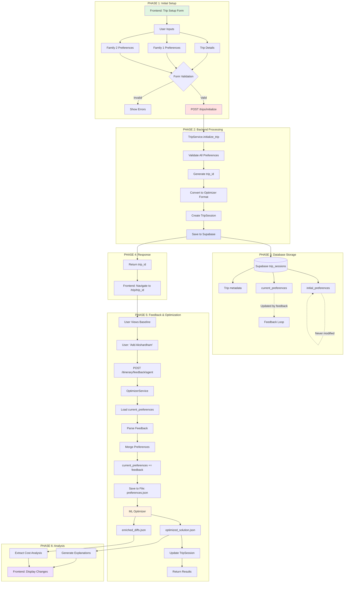

# Complete System Architecture - Initial Setup to Optimization



---

## Data Transformation Example

### Frontend Form Data:
```json
{
  "trip_name": "Delhi Tour",
  "families": [
    {
      "family_id": "FAM_A",
      "members": 4,
      "interest_vector": {"history": 0.9, ...},
      "must_visit_locations": ["LOC_008"]
    }
  ]
}
```

### Database (initial_preferences):
```json
{
  "FAM_A": {
    "family_id": "FAM_A",
    "members": 4,
    "budget_sensitivity": 0.9,
    "interest_vector": {"history": 0.9, ...},
    "must_visit_locations": ["LOC_008"],
    "never_visit_locations": []
  }
}
```

### Database (current_preferences) - Initially Same:
```json
{
  "FAM_A": {
    "family_id": "FAM_A",
    "members": 4,
    "budget_sensitivity": 0.9,
    "interest_vector": {"history": 0.9, ...},
    "must_visit_locations": ["LOC_008"],
    "never_visit_locations": []
  }
}
```

### After Feedback ("Add Akshardham"):
```json
{
  "FAM_A": {
    "family_id": "FAM_A",
    "members": 4,
    "budget_sensitivity": 0.9,
    "interest_vector": {"history": 0.9, ...},
    "must_visit_locations": ["LOC_008", "LOC_006"],  // ← Added
    "never_visit_locations": []
  }
}
```

### File Saved for ML Optimizer:
```json
{
  "family_id": "FAM_A",
  "members": 4,
  "children": 2,
  "budget_sensitivity": 0.9,
  "energy_level": 0.6,
  "pace_preference": "relaxed",
  "interest_vector": {
    "history": 0.9,
    "architecture": 0.8,
    ...
  },
  "must_visit_locations": ["LOC_008", "LOC_006"],  
  "never_visit_locations": [],
  "notes": "Budget sensitive. History buffs."
}
```

### ML Optimizer Output:
```json
{
  "days": [
    {
      "day": 1,
      "families": {
        "FAM_A": {
          "pois": [
            {"location_id": "LOC_008", "arrival_time": "09:30", ...},
            {"location_id": "LOC_006", "arrival_time": "14:00", ...}
          ]
        }
      }
    }
  ]
}
```

### Cost Analysis Extracted:
```json
{
  "total_cost_change": 150.0,
  "changes": [
    {
      "poi_name": "Akshardham",
      "cost_delta": 150.0,
      "reason": "User requested must-visit"
    }
  ]
}
```

### Final Response to Frontend:
```json
{
  "success": true,
  "explanations": [
    "We added Akshardham Temple to Day 1 at 2:00 PM. This costs ₹150 but increases satisfaction by 1.8 points."
  ],
  "cost_analysis": {
    "total_cost_change": 150.0,
    "changes": [...]
  },
  "itinerary_updated": true
}
```

---

## Complete System Summary

| Phase | Component | Input | Output | Storage |
|-------|-----------|-------|--------|---------|
| **1. Setup** | Frontend Form | User interactions | Trip data | Browser state |
| **2. Initialize** | TripService | Trip request | trip_id | Supabase |
| **3. Store** | Database | Preferences | Records | trip_sessions |
| **4. Display** | Frontend | trip_id | Baseline view | UI state |
| **5. Feedback** | FeedbackAgent | NL message | Structured event | Memory |
| **6. Merge** | OptimizerService | Event + current | Updated prefs | Database |
| **7. Optimize** | ML Optimizer | Preferences | Itinerary | Files |
| **8. Analyze** | CostAnalyzer | Diffs | Analysis | Memory |
| **9. Explain** | ExplainabilityAgent | Analysis | NL explanations | Files |
| **10. Display** | Frontend | Results | Updated UI | Browser state |

---

**Generated**: 2026-02-03  
**Purpose**: Visual system architecture overview
