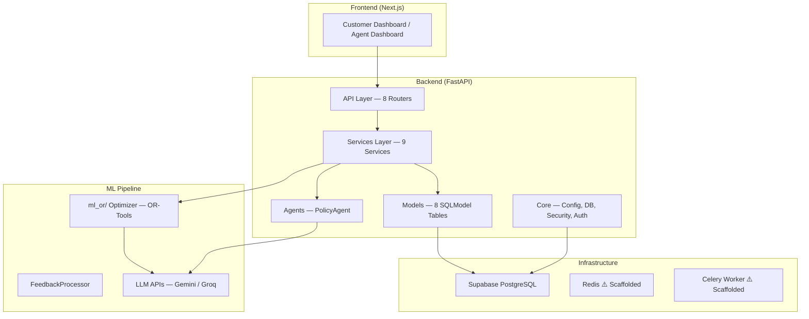

# MeiliAI Backend — Complete System Analysis & Development Roadmap

> **Audit Date**: February 17, 2026  
> **Scope**: Every file in `backend/` — API routers, services, models, schemas, core, agents, tests

---

## 1. System Overview

MeiliAI is an **AI-powered group travel itinerary platform**. The backend is a **FastAPI** app backed by **Supabase PostgreSQL**, with an agentic ML optimizer pipeline (OR-Tools + LLMs) for itinerary re-optimization based on natural language feedback.

---

## 2. What's DONE ✅

### 2.1 Core Infrastructure

| Component | File | Status | Details |
|---|---|---|---|
| **FastAPI App** | [main.py](file:///d:/Coding/Voyage/meiliai/backend/app/main.py) | ✅ Complete | App creation, CORS, 8 routers registered |
| **Configuration** | [config.py](file:///d:/Coding/Voyage/meiliai/backend/app/core/config.py) | ✅ Complete | pydantic-settings, all env vars: DB URI, JWT secret, API keys, ML paths |
| **Database** | [db.py](file:///d:/Coding/Voyage/meiliai/backend/app/core/db.py) | ✅ Complete | SQLModel engine, `pool_pre_ping`, [init_db()](file:///d:/Coding/Voyage/meiliai/backend/app/core/db.py#23-31), all 6 active models imported |
| **JWT Security** | [security.py](file:///d:/Coding/Voyage/meiliai/backend/app/core/security.py) | ✅ Complete | [create_access_token()](file:///d:/Coding/Voyage/meiliai/backend/app/core/security.py#9-19), [verify_password()](file:///d:/Coding/Voyage/meiliai/backend/app/services/user_service.py#16-20), [get_password_hash()](file:///d:/Coding/Voyage/meiliai/backend/app/services/user_service.py#21-25) |
| **Auth Dependencies** | [dependencies.py](file:///d:/Coding/Voyage/meiliai/backend/app/core/dependencies.py) | ✅ Complete | [get_current_user](file:///d:/Coding/Voyage/meiliai/backend/app/core/dependencies.py#12-24), [get_current_traveller](file:///d:/Coding/Voyage/meiliai/backend/app/core/dependencies.py#25-32), [get_current_agent](file:///d:/Coding/Voyage/meiliai/backend/app/core/dependencies.py#33-40) role guards |

---

### 2.2 Data Models (8 SQLModel Tables)

| Model | Table | Lines | Status | Notes |
|---|---|---|---|---|
| [User](file:///d:/Coding/Voyage/meiliai/backend/app/models/user.py) | `users` | 59 | ✅ Active | email, hashed_password, role, family_id, is_active, timestamps |
| [Family](file:///d:/Coding/Voyage/meiliai/backend/app/models/family.py) | [families](file:///d:/Coding/Voyage/meiliai/backend/app/services/family_service.py#109-118) | 73 | ✅ Active | family_code, family_name, current_itinerary_version FK, preferences JSONB, trip details |
| [TripSession](file:///d:/Coding/Voyage/meiliai/backend/app/models/trip_session.py) | `trip_sessions` | 108 | ✅ Active | Central state machine — trip_id, family_ids JSONB, itinerary paths, iteration_count, initial/current preferences JSONB, feedback_history JSONB, preference_history JSONB |
| [Itinerary](file:///d:/Coding/Voyage/meiliai/backend/app/models/itinerary.py) | `itineraries` | 81 | ✅ Active | family_id FK, version, data JSONB, created_reason, cost/satisfaction stats |
| [Event](file:///d:/Coding/Voyage/meiliai/backend/app/models/event.py) | [events](file:///d:/Coding/Voyage/meiliai/backend/app/services/event_service.py#108-120) | 99 | ✅ Active | event_type enum (9 types), entity_type, payload JSONB, status lifecycle (QUEUED→PROCESSING→COMPLETED/FAILED) |
| [Preference](file:///d:/Coding/Voyage/meiliai/backend/app/models/preference.py) | [preferences](file:///d:/Coding/Voyage/meiliai/backend/app/services/family_service.py#92-108) | 78 | ✅ Active | family_id FK, poi_id, preference_type enum (MUST/NEVER/PREFER/AVOID), strength, soft-delete |
| [PreferenceChange](file:///d:/Coding/Voyage/meiliai/backend/app/models/preference_history.py) | *(Pydantic only)* | 34 | ✅ In-memory | Audit trail model — not a DB table, stored in TripSession.preference_history JSONB |
| [POIRequest / FamilyResponseMessage / DecisionLog](file:///d:/Coding/Voyage/meiliai/backend/app/models/policy.py) | `poi_requests`, `family_responses`, `decision_logs` | 34 | ⚠️ Schema only | Tables defined but never written to (policy API uses mock session) |

---

### 2.3 Fully Working Services

| Service | File | Methods | What It Does |
|---|---|---|---|
| [UserService](file:///d:/Coding/Voyage/meiliai/backend/app/services/user_service.py) | 113 lines | [create_user](file:///d:/Coding/Voyage/meiliai/backend/app/services/user_service.py#39-92), [authenticate_user](file:///d:/Coding/Voyage/meiliai/backend/app/services/user_service.py#93-113), [get_user](file:///d:/Coding/Voyage/meiliai/backend/app/services/user_service.py#33-38), [get_user_by_email](file:///d:/Coding/Voyage/meiliai/backend/app/services/user_service.py#26-32), [verify_password](file:///d:/Coding/Voyage/meiliai/backend/app/services/user_service.py#16-20), [get_password_hash](file:///d:/Coding/Voyage/meiliai/backend/app/services/user_service.py#21-25) | Full auth CRUD. Auto-creates family on traveller signup. Uses `pbkdf2_sha256`. |
| [FamilyService](file:///d:/Coding/Voyage/meiliai/backend/app/services/family_service.py) | 118 lines | [create_family](file:///d:/Coding/Voyage/meiliai/backend/app/services/family_service.py#19-61), [get_family](file:///d:/Coding/Voyage/meiliai/backend/app/services/family_service.py#62-67), [get_family_by_code](file:///d:/Coding/Voyage/meiliai/backend/app/services/family_service.py#68-74), [update_current_itinerary](file:///d:/Coding/Voyage/meiliai/backend/app/services/family_service.py#75-91), [update_preferences](file:///d:/Coding/Voyage/meiliai/backend/app/services/family_service.py#92-108), [get_all_families](file:///d:/Coding/Voyage/meiliai/backend/app/services/family_service.py#109-118) | Full CRUD + preference management |
| [EventService](file:///d:/Coding/Voyage/meiliai/backend/app/services/event_service.py) | 120 lines | [create_event](file:///d:/Coding/Voyage/meiliai/backend/app/api/events.py#12-45), [get_event](file:///d:/Coding/Voyage/meiliai/backend/app/services/event_service.py#51-56), [update_event_status](file:///d:/Coding/Voyage/meiliai/backend/app/services/event_service.py#57-94), [get_events_by_family](file:///d:/Coding/Voyage/meiliai/backend/app/services/event_service.py#95-107), [get_pending_events](file:///d:/Coding/Voyage/meiliai/backend/app/services/event_service.py#108-120) | Full CRUD with status lifecycle |
| [ItineraryService](file:///d:/Coding/Voyage/meiliai/backend/app/services/itinerary_service.py) | 135 lines | [get_current_itinerary](file:///d:/Coding/Voyage/meiliai/backend/app/services/itinerary_service.py#21-40), [get_itinerary](file:///d:/Coding/Voyage/meiliai/backend/app/services/itinerary_service.py#41-46), [create_itinerary](file:///d:/Coding/Voyage/meiliai/backend/app/services/itinerary_service.py#47-110), [get_itinerary_history](file:///d:/Coding/Voyage/meiliai/backend/app/services/itinerary_service.py#111-123), [get_latest_version](file:///d:/Coding/Voyage/meiliai/backend/app/services/itinerary_service.py#124-135) | Versioned CRUD — auto-increments version, updates family pointer, calculates stats |
| [PreferenceService](file:///d:/Coding/Voyage/meiliai/backend/app/services/preference_service.py) | 147 lines | [add_preference](file:///d:/Coding/Voyage/meiliai/backend/app/services/preference_service.py#19-64), [get_family_preferences](file:///d:/Coding/Voyage/meiliai/backend/app/services/preference_service.py#65-74), [get_must_visit_pois](file:///d:/Coding/Voyage/meiliai/backend/app/services/preference_service.py#75-86), [get_never_visit_pois](file:///d:/Coding/Voyage/meiliai/backend/app/services/preference_service.py#87-98), [deactivate_preference](file:///d:/Coding/Voyage/meiliai/backend/app/services/preference_service.py#99-113), [get_preferences_as_dict](file:///d:/Coding/Voyage/meiliai/backend/app/services/preference_service.py#114-147) | Full CRUD + optimizer-compatible export |
| [TripService](file:///d:/Coding/Voyage/meiliai/backend/app/services/trip_service.py) | 540 lines | [initialize_trip](file:///d:/Coding/Voyage/meiliai/backend/app/services/trip_service.py#29-203), [get_trip_summary](file:///d:/Coding/Voyage/meiliai/backend/app/api/trips.py#259-289), [update_family_preferences](file:///d:/Coding/Voyage/meiliai/backend/app/api/trips.py#291-340), [get_active_trip_for_family](file:///d:/Coding/Voyage/meiliai/backend/app/services/trip_service.py#495-539) + internal helpers | **Trip initialization orchestrator** — validates preferences, generates trip ID, creates TripSession, converts to optimizer format, resolves baseline paths |
| [OptimizerService](file:///d:/Coding/Voyage/meiliai/backend/app/services/optimizer_service.py) | 442 lines | [create_trip_session](file:///d:/Coding/Voyage/meiliai/backend/app/services/optimizer_service.py#49-100), [get_trip_session](file:///d:/Coding/Voyage/meiliai/backend/app/services/optimizer_service.py#101-125), [update_trip_session](file:///d:/Coding/Voyage/meiliai/backend/app/services/optimizer_service.py#126-151), [save_preferences_after_optimization](file:///d:/Coding/Voyage/meiliai/backend/app/services/optimizer_service.py#152-185), [process_feedback_with_agents](file:///d:/Coding/Voyage/meiliai/backend/app/services/optimizer_service.py#187-296), [_extract_cost_analysis](file:///d:/Coding/Voyage/meiliai/backend/app/services/optimizer_service.py#297-336) + [DatabaseSessionManagerAdapter](file:///d:/Coding/Voyage/meiliai/backend/app/services/optimizer_service.py#338-442) | **ML optimizer bridge** — manages TripSession lifecycle, processes feedback through agent pipeline, adapter pattern for file-based optimizer ↔ DB |

---

### 2.4 Fully Working API Endpoints

| Endpoint | Method | Router | Auth | What It Does |
|---|---|---|---|---|
| `/api/v1/auth/login` | POST | [auth.py](file:///d:/Coding/Voyage/meiliai/backend/app/api/auth.py) | ❌ | OAuth2 login → validates against DB → returns JWT |
| `/api/v1/auth/signup` | POST | auth.py | ❌ | Creates user + auto-creates family → returns JWT |
| `/api/v1/trips/initialize` | POST | [trips.py](file:///d:/Coding/Voyage/meiliai/backend/app/api/trips.py) | Optional | Initialize trip with family preferences → creates TripSession in Supabase |
| `/api/v1/trips/{id}/summary` | GET | trips.py | ❌ | Full trip details: metadata, families, initial/current preferences, feedback count |
| `/api/v1/trips/{id}/families/{id}/preferences` | PATCH | trips.py | ❌ | Manual preference updates (before optimization) |
| `/api/v1/itinerary/current` | GET | [itinerary.py](file:///d:/Coding/Voyage/meiliai/backend/app/api/itinerary.py) | ✅ Bearer | Get current itinerary for authenticated user's family |
| `/api/v1/itinerary/feedback` | POST | itinerary.py | ✅ Bearer | Submit rating/comment feedback → creates Event |
| `/api/v1/itinerary/feedback/agent` | POST | itinerary.py | Optional | **Main endpoint** — NL feedback → LLM parsing → preference update → ML optimization → explanations + cost analysis |
| `/api/v1/itinerary/poi-request` | POST | itinerary.py | ✅ Bearer | Submit POI request → creates Event + Preference |
| `/api/v1/events/` | POST | [events.py](file:///d:/Coding/Voyage/meiliai/backend/app/api/events.py) | ✅ Bearer | Create system event |
| `/api/v1/agent/decision-policy/evaluate` | POST | [policy.py](file:///d:/Coding/Voyage/meiliai/backend/app/api/policy.py) | ❌ | Evaluate instability score via PolicyAgent |
| `/api/v1/demo/feedback` | POST | [demo_feedback.py](file:///d:/Coding/Voyage/meiliai/backend/app/api/demo_feedback.py) | ❌ | Demo feedback with in-memory itinerary |
| `/api/v1/demo/itinerary` | GET | demo_feedback.py | ❌ | Get demo itinerary state |
| `/api/v1/demo/reset` | POST | demo_feedback.py | ❌ | Reset demo itinerary |
| `/api/v1/demo/receive_optimization` | POST | demo_feedback.py | ❌ | Receive optimization data from demo script |
| `/api/v1/demo/latest_optimization` | GET | demo_feedback.py | ❌ | Get latest optimization data |

---

### 2.5 Agent & ML Pipeline

| Component | Status | Details |
|---|---|---|
| **PolicyAgent** | ✅ Working | Calculates instability score from votes, satisfaction delta, interest alignment, family weight. Decisions: OPTIMIZE, MANUAL_REVIEW, REJECT |
| **Feedback → Optimization Loop** | ✅ Working | User message → [OptimizerService](file:///d:/Coding/Voyage/meiliai/backend/app/services/optimizer_service.py#38-336) → `FeedbackProcessor` (from ml_or/) → LLM parses intent → updates preferences → OR-Tools optimizer → LLM generates explanations → cost analysis → response |
| **DatabaseSessionManagerAdapter** | ✅ Working | Adapter pattern bridging DB-backed TripSession ↔ file-based FeedbackProcessor |
| **Fallback Mode** | ✅ Working | If ml_or/ or agent dependencies unavailable, feedback is acknowledged and stored |
| **ml_or/ Module** | ✅ Available | Full optimizer with [itinerary_optimizer.py](file:///d:/Coding/Voyage/meiliai/ml_or/itinerary_optimizer.py) (83KB), data files, demos, tests, explainability module |

---

### 2.6 TBO Hotels Integration

| Component | Status | Details |
|---|---|---|
| [TBOService](file:///d:/Coding/Voyage/meiliai/backend/app/services/tbo_service.py) | ⚠️ Functional but Disconnected | SOAP/Zeep client connects to TBO API, supports [search_hotels()](file:///d:/Coding/Voyage/meiliai/backend/app/services/tbo_service.py#43-60) (city code lookup + hotel search), hardcoded credentials |
| Test Files | ✅ Created | 3 test files in `backend/test/`: `test_tbo_hotel_api.py`, `test_tbo_hotel_search.py`, `test_tbo_booking_flow.py` |
| [API Docs](file:///d:/Coding/Voyage/meiliai/backend/test/TBO_HOTEL_API_DOCS.md) | ✅ Written | Comprehensive TBO Hotel API documentation |

---

## 3. What's SCAFFOLDED / PARTIAL ⚠️

These have code structure but use mock data or have TODO comments in the source.

### 3.1 Agent Dashboard API

[agent_dashboard.py](file:///d:/Coding/Voyage/meiliai/backend/app/api/agent_dashboard.py) — 176 lines, entirely mock

| Endpoint | Issue |
|---|---|
| `GET /agent/itinerary/options` | Returns **hardcoded mock options** (TODO: query `itinerary_options` table) |
| `POST /agent/itinerary/approve` | Returns **mock approval** (TODO: update DB, trigger Tools Agent + Communication Agent) |

> [!IMPORTANT]
> Both endpoints have detailed TODO comments describing the intended DB queries and agent triggers. The Pydantic models (`ItineraryOption`, `ApproveRequest`, `ApproveResponse`) are well-defined.

### 3.2 Bookings API

[bookings.py](file:///d:/Coding/Voyage/meiliai/backend/app/api/bookings.py) — 103 lines, mock

| Endpoint | Issue |
|---|---|
| `POST /bookings/execute` | Returns **mock job ID** (TODO: create booking_jobs table, queue Celery task, call external APIs) |

> [!IMPORTANT]
> Has detailed TODO for: (1) DB implementation with booking_jobs table, (2) Async job integration with Celery, (3) External API calls (flight, hotel, restaurant), (4) WebSocket notification to agent.

### 3.3 Policy API — DB Persistence

[policy.py](file:///d:/Coding/Voyage/meiliai/backend/app/api/policy.py) — 68 lines

- PolicyAgent **evaluation works** (returns correct scores/decisions)
- DB persistence is **commented out** — POIRequest, FamilyResponseMessage, DecisionLog models exist but are never written to
- Uses `get_mock_session()` returning `None`

### 3.4 AgentService — Fallback Mode

[agent_service.py](file:///d:/Coding/Voyage/meiliai/backend/app/services/agent_service.py) — 211 lines

- `process_feedback_event()` — Has full agent pipeline code but runs in **FALLBACK_MODE** if agents unavailable
- `process_poi_request_event()` — Acknowledges only (TODO: trigger optimizer)
- `process_incident_event()` — Acknowledges only (TODO: handle via DecisionAgent)

### 3.5 Trip Listing & Deletion

In [trips.py](file:///d:/Coding/Voyage/meiliai/backend/app/api/trips.py):

| Endpoint | Issue |
|---|---|
| `GET /trips/` | Returns **501 Not Implemented** |
| `DELETE /trips/{id}` | Returns **501 Not Implemented** |

### 3.6 Infrastructure (Celery + Redis)

| Component | File | Issue |
|---|---|---|
| [celery_app.py](file:///d:/Coding/Voyage/meiliai/backend/app/core/celery_app.py) | 12 lines | Celery app created with redis broker, **no task routes defined** |
| [redis.py](file:///d:/Coding/Voyage/meiliai/backend/app/core/redis.py) | 25 lines | `RedisManager` singleton with async client, **completely unused** |
| [worker.py](file:///d:/Coding/Voyage/meiliai/backend/app/worker.py) | 7 lines | Imports celery_app, **all tasks removed** |
| [auth.py](file:///d:/Coding/Voyage/meiliai/backend/app/core/auth.py) | 0 lines | **Empty placeholder file** |

---

## 4. What's NOT BUILT ❌

These features are **referenced in code comments or architecture diagrams** but have zero implementation.

### 4.1 High-Priority (Core Flow Gaps)

| Feature | Priority | Why It's Needed |
|---|---|---|
| **Trip Listing API** | 🔴 High | Customers need to see their trips — currently returns 501 |
| **Trip Deletion/Archival** | 🔴 High | No way to manage old trips — currently returns 501 |
| **Agent Dashboard — Real Data** | 🔴 High | Agent UI has no real data source — needs `itinerary_options` table + service |
| **Booking Execution Flow** | 🔴 High | Entire booking pipeline is mock — no external API calls, no job tracking |
| **TBO Service → Booking Integration** | 🔴 High | TBO SOAP client works but isn't connected to the booking flow |

### 4.2 Medium-Priority (Platform Features)

| Feature | Priority | Why It's Needed |
|---|---|---|
| **Async Event Processing** | 🟡 Medium | Events are processed synchronously — Celery tasks not defined |
| **WebSocket Real-time Updates** | 🟡 Medium | Agent approval notifications, booking status, itinerary changes |
| **Communication Agent** | 🟡 Medium | No automated traveller notification after itinerary changes |
| **Tools Agent** | 🟡 Medium | No automated booking execution after agent approval |
| **Itinerary Diff API** | 🟡 Medium | Frontend needs structured diff data for version comparison |
| **Policy DB Persistence** | 🟡 Medium | PolicyAgent decisions not saved to DB for audit |
| **User Profile API** | 🟡 Medium | No endpoints for viewing/updating user profiles |
| **Family Member Management** | 🟡 Medium | No endpoints to add/remove family members |

### 4.3 Lower-Priority (Polish & Production)

| Feature | Priority | Why It's Needed |
|---|---|---|
| **Redis Caching** | 🟢 Low | Client ready but not used — could cache itineraries, preferences |
| **Rate Limiting** | 🟢 Low | No rate limiting on any endpoint |
| **Database Migrations** | 🟢 Low | Using `init_db()` to create tables — no proper migration framework (Alembic) |
| **Error Handling Middleware** | 🟢 Low | Inconsistent error handling across routers |
| **Logging Middleware** | 🟢 Low | Using print statements instead of structured logging |
| **Health Check Endpoint** | 🟢 Low | No `/health` endpoint for monitoring |
| **API Pagination** | 🟢 Low | Most list endpoints lack cursor-based pagination |
| **Input Sanitization** | 🟢 Low | Some endpoints accept freeform strings without sanitization |
| **Test Suite** | 🟢 Low | Only TBO-specific tests exist; no unit tests for services/APIs |
| **Docker Support** | 🟢 Low | No Dockerfile or docker-compose for backend |
| **TBO Credentials in Config** | 🟢 Low | Hardcoded in `tbo_service.py` — should move to `.env` |

---

## 5. Code Quality Issues

| Issue | Location | Impact |
|---|---|---|
| **Duplicate dependency** | `requirements.txt` — `sqlmodel` and `redis` listed twice | Low — works but messy |
| **Password hashing mismatch** | `security.py` uses **bcrypt**, `user_service.py` uses **pbkdf2_sha256** | 🔴 **Potential auth bug** — if JWT creates tokens after verifying with one scheme but user was hashed with the other |
| **No Alembic migrations** | Using `init_db()` + manual `migrate_*.py` scripts | Medium — risky for schema changes in production |
| **No relationship loading** | Models have commented-out `Relationship()` declarations | Low — using explicit queries instead |
| **Demo code in production** | `demo_feedback.py` (366 lines) with in-memory state | Low — separate router but should be behind feature flag |
| **Empty file** | `core/auth.py` — 0 bytes | Low — dead file |
| **Print-based logging** | Multiple files use `print()` instead of `logger` | Medium — no structured logging in production |

> [!WARNING]
> The password hashing mismatch between `security.py` (bcrypt) and `user_service.py` (pbkdf2_sha256) is a **potential authentication bug**. Verify which scheme is actually being used during registration vs login.

---

## 6. File-by-File Inventory

### API Routers (8 files, 1,172 total lines)

| File | Lines | Endpoints | Status |
|---|---|---|---|
| [auth.py](file:///d:/Coding/Voyage/meiliai/backend/app/api/auth.py) | 83 | 2 | ✅ Complete |
| [trips.py](file:///d:/Coding/Voyage/meiliai/backend/app/api/trips.py) | 368 | 5 | ⚠️ 3 working, 2 return 501 |
| [itinerary.py](file:///d:/Coding/Voyage/meiliai/backend/app/api/itinerary.py) | 328 | 4 | ✅ Complete |
| [events.py](file:///d:/Coding/Voyage/meiliai/backend/app/api/events.py) | 46 | 1 | ✅ Complete |
| [agent_dashboard.py](file:///d:/Coding/Voyage/meiliai/backend/app/api/agent_dashboard.py) | 176 | 2 | ⚠️ All mock |
| [bookings.py](file:///d:/Coding/Voyage/meiliai/backend/app/api/bookings.py) | 103 | 1 | ⚠️ Mock |
| [policy.py](file:///d:/Coding/Voyage/meiliai/backend/app/api/policy.py) | 68 | 1 | ⚠️ Agent works, DB commented out |
| [demo_feedback.py](file:///d:/Coding/Voyage/meiliai/backend/app/api/demo_feedback.py) | 366 | 5 | ✅ Complete (demo-only) |

### Services (9 files, 1,976 total lines)

| File | Lines | Status |
|---|---|---|
| [user_service.py](file:///d:/Coding/Voyage/meiliai/backend/app/services/user_service.py) | 113 | ✅ Complete |
| [family_service.py](file:///d:/Coding/Voyage/meiliai/backend/app/services/family_service.py) | 118 | ✅ Complete |
| [event_service.py](file:///d:/Coding/Voyage/meiliai/backend/app/services/event_service.py) | 120 | ✅ Complete |
| [itinerary_service.py](file:///d:/Coding/Voyage/meiliai/backend/app/services/itinerary_service.py) | 135 | ✅ Complete |
| [preference_service.py](file:///d:/Coding/Voyage/meiliai/backend/app/services/preference_service.py) | 147 | ✅ Complete |
| [trip_service.py](file:///d:/Coding/Voyage/meiliai/backend/app/services/trip_service.py) | 540 | ✅ Complete |
| [optimizer_service.py](file:///d:/Coding/Voyage/meiliai/backend/app/services/optimizer_service.py) | 442 | ✅ Complete |
| [agent_service.py](file:///d:/Coding/Voyage/meiliai/backend/app/services/agent_service.py) | 211 | ⚠️ Fallback mode |
| [tbo_service.py](file:///d:/Coding/Voyage/meiliai/backend/app/services/tbo_service.py) | 131 | ⚠️ Functional but disconnected |

### Models (8 files, 566 total lines)

| File | Lines | Status |
|---|---|---|
| [user.py](file:///d:/Coding/Voyage/meiliai/backend/app/models/user.py) | 59 | ✅ Active table |
| [family.py](file:///d:/Coding/Voyage/meiliai/backend/app/models/family.py) | 73 | ✅ Active table |
| [trip_session.py](file:///d:/Coding/Voyage/meiliai/backend/app/models/trip_session.py) | 108 | ✅ Active table |
| [itinerary.py](file:///d:/Coding/Voyage/meiliai/backend/app/models/itinerary.py) | 81 | ✅ Active table |
| [event.py](file:///d:/Coding/Voyage/meiliai/backend/app/models/event.py) | 99 | ✅ Active table |
| [preference.py](file:///d:/Coding/Voyage/meiliai/backend/app/models/preference.py) | 78 | ✅ Active table |
| [preference_history.py](file:///d:/Coding/Voyage/meiliai/backend/app/models/preference_history.py) | 34 | ✅ Pydantic-only (stored in JSONB) |
| [policy.py](file:///d:/Coding/Voyage/meiliai/backend/app/models/policy.py) | 34 | ⚠️ Schema defined, never written to |

### Schemas (4 files)

| File | Purpose |
|---|---|
| [auth.py](file:///d:/Coding/Voyage/meiliai/backend/app/schemas/auth.py) | `Token`, `UserCreate`, `TokenPayload` |
| [events.py](file:///d:/Coding/Voyage/meiliai/backend/app/schemas/events.py) | `EventCreate`, `EventResponse`, `EventStatus` |
| [itinerary.py](file:///d:/Coding/Voyage/meiliai/backend/app/schemas/itinerary.py) | `Itinerary` schema |
| [policy.py](file:///d:/Coding/Voyage/meiliai/backend/app/schemas/policy.py) | `PolicyEvaluationRequest`, `PolicyDecisionResponse` |

---

## 7. Recommended Development Order

Based on dependency chains and maximum impact, here's the suggested order for further development:

### Phase 1: Complete Core CRUD (1-2 days)
1. **Implement `GET /trips/`** — List trips for authenticated user/family
2. **Implement `DELETE /trips/{id}`** — Archive trip (soft delete, don't hard-delete)
3. **Fix password hashing mismatch** — Standardize on one scheme
4. **Remove empty `core/auth.py`** — Dead file cleanup
5. **Add `GET /api/v1/users/me`** — User profile endpoint

### Phase 2: Agent Dashboard (2-3 days)
6. **Create `itinerary_options` table** — Model for optimizer output options
7. **Implement real `GET /agent/itinerary/options`** — Query DB for pre-computed options
8. **Implement real `POST /agent/itinerary/approve`** — Update DB + trigger downstream
9. **Add `GET /agent/events` endpoint** — List events for agent review

### Phase 3: Booking Pipeline (3-4 days)
10. **Create `booking_jobs` table** — Model for tracking booking state
11. **Define Celery tasks** — `execute_booking_task`, `check_booking_status_task`
12. **Connect TBO Service** — Wire `tbo_service.search_hotels()` into booking flow
13. **Add `GET /bookings/{job_id}/status`** — Track booking progress
14. **Implement hotel booking via TBO** — `tbo_service.book_hotel()`

### Phase 4: Real-time & Notifications (2-3 days)
15. **Add WebSocket endpoint** — For real-time updates (booking status, itinerary changes)
16. **Create Communication Agent** — Send notifications after itinerary approval
17. **Create Tools Agent** — Automated booking execution after approval

### Phase 5: Production Hardening (2-3 days)
18. **Set up Alembic** — Proper database migrations
19. **Add structured logging** — Replace `print()` with `logger.info/error()`
20. **Add health check** — `GET /health` returning DB/Redis status
21. **Add rate limiting** — Especially on auth endpoints
22. **Write unit tests** — For services and API endpoints
23. **Move TBO credentials to .env** — Security improvement
24. **Clean up `requirements.txt`** — Remove duplicate entries

---

## 8. Summary Stats

| Category | Count |
|---|---|
| **Total Python files** | 48 |
| **Total lines of code** | ~4,500+ |
| **Active DB tables** | 6 (users, families, trip_sessions, itineraries, events, preferences) |
| **Defined-but-unused DB tables** | 3 (poi_requests, family_responses, decision_logs) |
| **Working API endpoints** | 16 |
| **Mock/501 API endpoints** | 5 |
| **Fully implemented services** | 7/9 |
| **Partially implemented services** | 2/9 (AgentService, TBOService) |

> **Bottom Line**: The core trip initialization → feedback → ML optimization → response loop is **fully working end-to-end**. The main gaps are in the **agent dashboard** (mock data), **booking pipeline** (no external API calls), **async processing** (Celery tasks not defined), and **CRUD completeness** (trip listing/deletion returns 501). The architecture is solid — most remaining work is filling in the scaffolded sections.
