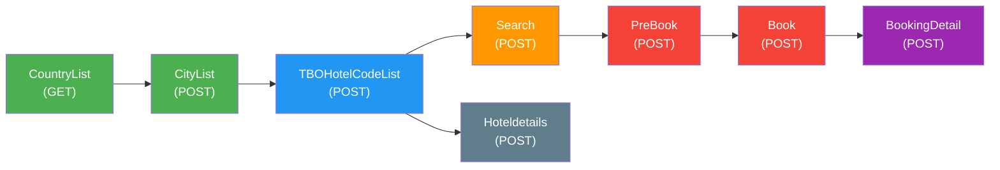

# TBO Hotel API — Integration Guide

> **Complete reference for backend development with the TBO Holidays Hotel API.**
> Based on live testing against the staging environment (Feb 2026).

---

## Authentication

| Parameter | Value |
|-----------|-------|
| **Base URL** | `http://api.tbotechnology.in/TBOHolidays_HotelAPI` |
| **Auth Type** | HTTP Basic Auth |
| **Username** | `hackathontest` |
| **Password** | `Hac@98147521` |

All requests must include the `Authorization: Basic <base64(user:pass)>` header.
With Python `requests`, use `HTTPBasicAuth("hackathontest", "Hac@98147521")`.

### Standard Headers

```json
{
  "Content-Type": "application/json",
  "Accept": "application/json"
}
```

### Web Portal Access

| Parameter | Value |
|-----------|-------|
| **URL** | `https://api.tbotechnology.in/` |
| **Username** | `hackathontest` |
| **Password** | `Hackathon@12345` |

### Dummy Booking Portal

| Parameter | Value |
|-----------|-------|
| **URL** | `prep.tboholidays.com` |
| **Username** | `tbohackathonnew` |
| **Password** | `Tboagency@123` |

---

## API Architecture Overview



### Flow Summary

| Phase | Endpoints | Purpose |
|-------|-----------|---------|
| **Discovery** | CountryList → CityList → TBOHotelCodeList | Get geography + hotel inventory |
| **Search** | Search | Find available rooms & pricing |
| **Booking** | PreBook → Book → BookingDetail | Reserve, confirm, and retrieve bookings |
| **Info** | Hoteldetails | Rich hotel metadata (name, rating, address, description, images) |

> [!IMPORTANT]
> The `/Search` endpoint **requires** `HotelCodes` (comma-separated). You must first call `TBOHotelCodeList` to get hotel codes for a city before you can search.

---

## Endpoints — Detailed Reference

---

### 1. `GET /CountryList`

Returns all countries supported by TBO's hotel inventory.

**Method:** `GET`
**Auth:** Basic Auth
**Parameters:** None

#### Request

```python
import requests
from requests.auth import HTTPBasicAuth

resp = requests.get(
    "http://api.tbotechnology.in/TBOHolidays_HotelAPI/CountryList",
    auth=HTTPBasicAuth("hackathontest", "Hac@98147521"),
    headers={"Accept": "application/json"},
)
data = resp.json()
```

#### Response

```json
{
  "CountryList": [
    { "Code": "AF", "Name": "Afghanistan" },
    { "Code": "IN", "Name": "India" },
    { "Code": "AE", "Name": "United Arab Emirates" },
    { "Code": "US", "Name": "United States" }
  ]
}
```

| Field | Type | Description |
|-------|------|-------------|
| `CountryList` | `Array` | List of country objects |
| `CountryList[].Code` | `string` | ISO 2-letter country code |
| `CountryList[].Name` | `string` | Country name |

**Verified:** 250 countries returned.

---

### 2. `POST /CityList`

Returns all destination cities within a given country.

**Method:** `POST`
**Auth:** Basic Auth

#### Request Body

```json
{
  "CountryCode": "IN"
}
```

| Field | Type | Required | Description |
|-------|------|----------|-------------|
| `CountryCode` | `string` | ✅ | ISO 2-letter country code |

#### Response

```json
{
  "Status": {
    "Code": 200,
    "Description": "Success"
  },
  "CityList": [
    { "Code": "418069", "Name": "Delhi NCR" },
    { "Code": "131408", "Name": "Mumbai" },
    { "Code": "130299", "Name": "Goa" },
    { "Code": "130614", "Name": "Jaipur" }
  ]
}
```

| Field | Type | Description |
|-------|------|-------------|
| `Status.Code` | `int` | `200` = success |
| `CityList` | `Array` | List of city objects |
| `CityList[].Code` | `string` | TBO internal city code (used in subsequent calls) |
| `CityList[].Name` | `string` | City / region name |

**Verified:** 1,009 cities returned for India.

> [!TIP]
> Common city codes for testing:
> | City | Code |
> |------|------|
> | Delhi NCR | `418069` |
> | Mumbai | `131408` |
> | Goa | `130299` |
> | Jaipur | `130614` |
> | Dubai | `114923` |
> | Bangkok | `108048` |

---

### 3. `POST /TBOHotelCodeList`

Returns hotel codes and basic metadata for all hotels in a given city. These codes are **required** for the `/Search` endpoint.

**Method:** `POST`
**Auth:** Basic Auth

#### Request Body

```json
{
  "CityCode": "418069",
  "IsDetailedResponse": true
}
```

| Field | Type | Required | Description |
|-------|------|----------|-------------|
| `CityCode` | `string` | ✅ | TBO city code from `/CityList` |
| `IsDetailedResponse` | `bool` | ❌ | If `true`, returns extra fields like hotel name, rating, URL |

#### Response

```json
{
  "Status": {
    "Code": 200,
    "Description": "Success"
  },
  "Hotels": [
    {
      "HotelCode": "1011662",
      "HotelName": "Regenta Hotel and Convention Centre",
      "HotelRating": "FourStar",
      "HotelWebsiteUrl": "http://...",
      "CityName": "New Delhi"
    },
    {
      "HotelCode": "1011664",
      "HotelName": "Oodles Hotel",
      "HotelRating": "ThreeStar",
      "HotelWebsiteUrl": "http://oodleshotels.com",
      "CityName": "New Delhi"
    }
  ]
}
```

| Field | Type | Description |
|-------|------|-------------|
| `Hotels` | `Array` | List of hotel metadata objects |
| `Hotels[].HotelCode` | `string` | **Key identifier** — used in `/Search` and `/Hoteldetails` |
| `Hotels[].HotelName` | `string` | Hotel display name |
| `Hotels[].HotelRating` | `string` | Star rating (`OneStar`, `TwoStar`, `ThreeStar`, `FourStar`, `FiveStar`) |
| `Hotels[].HotelWebsiteUrl` | `string` | Hotel website URL |
| `Hotels[].CityName` | `string` | City name |

**Verified:** 4,284 hotels returned for Delhi NCR.

> [!NOTE]
> The `HotelCode` is the primary key for all hotel-related operations. Cache these per city to avoid repeated calls.

---

### 4. `POST /Search`

**The core endpoint.** Searches for hotel room availability and pricing for given hotel codes and dates.

**Method:** `POST`
**Auth:** Basic Auth

> [!CAUTION]
> The field names are `CheckIn` / `CheckOut` — **NOT** `CheckInDate` / `CheckOutDate`. Using the wrong names returns `400: Check In Date can not be null or empty`.

#### Request Body

```json
{
  "CheckIn": "2026-03-18",
  "CheckOut": "2026-03-20",
  "NoOfRooms": "1",
  "GuestNationality": "IN",
  "PaxRooms": [
    {
      "Adults": 2,
      "Children": 0,
      "ChildrenAges": null
    }
  ],
  "ResponseTime": 23.0,
  "IsDetailedResponse": true,
  "Filters": {
    "Refundable": false,
    "NoOfRooms": 0,
    "MealType": 0
  },
  "HotelCodes": "1011662,1011664,1016351,1016321"
}
```

| Field | Type | Required | Description |
|-------|------|----------|-------------|
| `CheckIn` | `string` | ✅ | Check-in date, format: **`YYYY-MM-DD`** |
| `CheckOut` | `string` | ✅ | Check-out date, format: **`YYYY-MM-DD`** |
| `NoOfRooms` | `string` | ✅ | Number of rooms (as string) |
| `GuestNationality` | `string` | ✅ | ISO 2-letter country code of guest |
| `PaxRooms` | `Array` | ✅ | Room occupancy config (one per room) |
| `PaxRooms[].Adults` | `int` | ✅ | Number of adults |
| `PaxRooms[].Children` | `int` | ✅ | Number of children |
| `PaxRooms[].ChildrenAges` | `Array<int>` \| `null` | ❌ | Ages of children (if any) |
| `ResponseTime` | `float` | ❌ | Max wait time in seconds (default: 23) |
| `IsDetailedResponse` | `bool` | ❌ | Return extra details per room |
| `Filters.Refundable` | `bool` | ❌ | Filter only refundable rooms |
| `Filters.NoOfRooms` | `int` | ❌ | Filter by room count (0 = any) |
| `Filters.MealType` | `int` | ❌ | Filter by meal type (0 = any) |
| `HotelCodes` | `string` | ✅ | **Comma-separated hotel codes** from `TBOHotelCodeList` |

#### Response

```json
{
  "Status": {
    "Code": 200,
    "Description": "Successful"
  },
  "TraceId": "a1b2c3d4-e5f6-7890-abcd-ef1234567890",
  "HotelResult": [
    {
      "HotelCode": "1016351",
      "Currency": "USD",
      "Rooms": [
        {
          "Name": ["Superior Room,1 King Bed,NonSmoking"],
          "BookingCode": "1016351!TB!1!TB!672f0d0f-4672-4b13-b446-77234ef4b4fc",
          "Inclusion": "Free valet parking,Free self parking",
          "DayRates": [
            [
              { "BasePrice": 198.592 },
              { "BasePrice": 151.712 }
            ]
          ],
          "TotalFare": 414.44,
          "TotalTax": 64.14,
          "RoomPromotion": ["Book early and save"],
          "CancelPolicies": [
            {
              "FromDate": "15-02-2026 00:00:00",
              "ChargeType": "Percentage",
              "CancellationCharge": 100.0
            }
          ],
          "MealType": "Room_Only",
          "IsRefundable": false,
          "WithTransfers": false
        }
      ]
    }
  ]
}
```

#### Response Field Reference

| Field | Type | Description |
|-------|------|-------------|
| `Status.Code` | `int` | `200` = success, `201` = no rooms available, `400` = bad request |
| `TraceId` | `string` | **Session identifier** — required for PreBook/Book |
| `HotelResult` | `Array` | Hotels with available rooms |
| `HotelResult[].HotelCode` | `string` | Hotel identifier |
| `HotelResult[].Currency` | `string` | Price currency (e.g. `USD`) |
| `HotelResult[].Rooms` | `Array` | Available room types |

#### Room Object Fields

| Field | Type | Description |
|-------|------|-------------|
| `Name` | `Array<string>` | Room type name(s) — **always an array** |
| `BookingCode` | `string` | **Unique room booking ID** — required for PreBook/Book |
| `Inclusion` | `string` | What's included (parking, breakfast, etc.) |
| `DayRates` | `Array<Array<{BasePrice}>>` | Per-night base prices |
| `TotalFare` | `float` | Total price including markup |
| `TotalTax` | `float` | Tax amount |
| `RoomPromotion` | `Array<string>` | Active promotions |
| `CancelPolicies` | `Array` | Cancellation rules |
| `CancelPolicies[].FromDate` | `string` | Policy effective date (`DD-MM-YYYY HH:mm:ss`) |
| `CancelPolicies[].ChargeType` | `string` | `Fixed` or `Percentage` |
| `CancelPolicies[].CancellationCharge` | `float` | Charge amount/percentage |
| `MealType` | `string` | `Room_Only`, `BreakFast`, `HalfBoard`, `FullBoard`, `AllInclusive` |
| `IsRefundable` | `bool` | Whether this room is refundable |
| `WithTransfers` | `bool` | Includes airport transfers |

**Verified:** 13 hotels with availability returned for 50 Delhi NCR hotel codes.

> [!WARNING]
> The `Name` field is always an **array of strings**, not a plain string. Always access as `room["Name"][0]`.

---

### 5. `POST /Hoteldetails`

Returns rich metadata for one or more hotels: name, address, description, amenities, images.

**Method:** `POST`
**Auth:** Basic Auth

#### Request Body

```json
{
  "Hotelcodes": "1016351",
  "Language": "EN"
}
```

| Field | Type | Required | Description |
|-------|------|----------|-------------|
| `Hotelcodes` | `string` | ✅ | Hotel code(s), comma-separated |
| `Language` | `string` | ❌ | Language code (default: `EN`) |

#### Response

```json
{
  "Status": {
    "Code": 200,
    "Description": "Successful"
  },
  "HotelDetails": [
    {
      "HotelCode": "1016351",
      "HotelName": "The Roseate New Delhi",
      "HotelRating": "FiveStar",
      "Address": "NH 8, Asset No. 1, Aerocity Hospitality District",
      "CityName": "New Delhi",
      "CountryName": "India",
      "Description": "The Roseate offers a spa and wellness centre...",
      "HotelFacilities": ["Free WiFi", "Pool", "Spa", "Restaurant"],
      "Images": ["https://...image1.jpg", "https://...image2.jpg"]
    }
  ]
}
```

| Field | Type | Description |
|-------|------|-------------|
| `HotelDetails` | `Array` | Detailed hotel objects |
| `HotelDetails[].HotelName` | `string` | Full hotel name |
| `HotelDetails[].HotelRating` | `string` | Star rating string |
| `HotelDetails[].Address` | `string` | Street address |
| `HotelDetails[].CityName` | `string` | City name |
| `HotelDetails[].CountryName` | `string` | Country name |
| `HotelDetails[].Description` | `string` | HTML or plain text description |
| `HotelDetails[].HotelFacilities` | `Array<string>` | Amenity list |
| `HotelDetails[].Images` | `Array<string>` | Image URLs |

---

### 6. `POST /PreBook`

Confirms current pricing for a selected room before final booking. Call after `/Search`.

**Method:** `POST`
**Auth:** Basic Auth

#### Request Body

```json
{
  "BookingCode": "1016351!TB!1!TB!672f0d0f-4672-4b13-b446-77234ef4b4fc",
  "TraceId": "a1b2c3d4-e5f6-7890-abcd-ef1234567890"
}
```

| Field | Type | Required | Description |
|-------|------|----------|-------------|
| `BookingCode` | `string` | ✅ | From `Search` response → `Rooms[].BookingCode` |
| `TraceId` | `string` | ✅ | From `Search` response → `TraceId` |

#### Response

Returns confirmed pricing and cancellation details. If the price has changed, this response reflects the updated amount.

---

### 7. `POST /Book`

Creates a confirmed hotel booking.

**Method:** `POST`
**Auth:** Basic Auth

#### Request Body

```json
{
  "BookingCode": "1016351!TB!1!TB!672f0d0f-4672-4b13-b446-77234ef4b4fc",
  "TraceId": "a1b2c3d4-e5f6-7890-abcd-ef1234567890",
  "Passengers": [
    {
      "Title": "Mr",
      "FirstName": "Shaurya",
      "MiddleName": "",
      "LastName": "Sinha",
      "Phoneno": "9999999999",
      "Email": "test@meili.ai",
      "PaxType": 1,
      "LeadPassenger": true,
      "Age": 30,
      "PassportNo": "",
      "PassportIssueDate": "",
      "PassportExpDate": "",
      "PAN": ""
    }
  ]
}
```

| Field | Type | Required | Description |
|-------|------|----------|-------------|
| `BookingCode` | `string` | ✅ | Room booking code |
| `TraceId` | `string` | ✅ | Session trace ID |
| `Passengers` | `Array` | ✅ | Guest details |
| `Passengers[].Title` | `string` | ✅ | `Mr`, `Mrs`, `Ms`, `Miss` |
| `Passengers[].FirstName` | `string` | ✅ | Guest first name |
| `Passengers[].LastName` | `string` | ✅ | Guest last name |
| `Passengers[].Phoneno` | `string` | ✅ | Phone number |
| `Passengers[].Email` | `string` | ✅ | Email address |
| `Passengers[].PaxType` | `int` | ✅ | `1` = Adult, `2` = Child |
| `Passengers[].LeadPassenger` | `bool` | ✅ | Primary guest (first passenger) |
| `Passengers[].Age` | `int` | ❌ | Guest age |

#### Response

```json
{
  "Status": { "Code": 200, "Description": "Successful" },
  "BookResult": {
    "BookingStatus": "Confirmed",
    "ConfirmationNo": "TBO-12345678",
    "BookingId": "98765432",
    "HotelName": "The Roseate New Delhi",
    "HotelCode": "1016351",
    "CheckIn": "2026-03-18",
    "CheckOut": "2026-03-20",
    "TotalFare": 414.44,
    "Currency": "USD"
  }
}
```

---

### 8. `POST /BookingDetail`

Retrieves details of a confirmed booking by ID.

**Method:** `POST`
**Auth:** Basic Auth

#### Request Body

```json
{
  "BookingId": "98765432"
}
```

#### Response

Returns full booking details including guest info, room type, pricing, cancellation policy, and confirmation number.

---

## Status Codes

| Code | Meaning |
|------|---------|
| `200` | Success — data returned |
| `201` | No available rooms for the given criteria |
| `400` | Bad request — missing or invalid parameters |
| `401` | Authentication failure |
| `405` | Method not allowed (e.g., using POST on a GET-only endpoint) |
| `500` | Internal server error |

---

## Common Pitfalls & Gotchas

> [!CAUTION]
> **These can cost hours of debugging.** Every one was discovered through live testing.

### 1. Date Field Names
```diff
- "CheckInDate": "2026-03-18"    ❌ Returns 400
+ "CheckIn": "2026-03-18"        ✅ Works
```

### 2. Date Format
```diff
- "CheckIn": "03/18/2026"        ❌ Returns 400
- "CheckIn": "18/03/2026"        ❌ Returns 400
+ "CheckIn": "2026-03-18"        ✅ YYYY-MM-DD only
```

### 3. GET vs POST
| Endpoint | Method |
|----------|--------|
| `CountryList` | **GET** only |
| Everything else | **POST** only |

### 4. HotelCodes Required for Search
The `/Search` endpoint does **not** accept city codes or city names directly. You must:
1. Call `CityList` → get city code
2. Call `TBOHotelCodeList` → get hotel codes
3. Pass hotel codes (comma-separated) to `/Search`

### 5. Room Name is an Array
```python
# ❌ Wrong
room_name = room["Name"]       # Returns: ["Superior Room,1 King Bed,NonSmoking"]

# ✅ Correct
room_name = room["Name"][0]    # Returns: "Superior Room,1 King Bed,NonSmoking"
```

### 6. NoOfRooms is a String
```diff
- "NoOfRooms": 1        ❌ Integer
+ "NoOfRooms": "1"      ✅ String
```

---

## Integration Code — Python Helper Class

A ready-to-use Python client for backend integration:

```python
"""TBO Hotel API Client for Meili AI backend."""

import requests
from requests.auth import HTTPBasicAuth
from datetime import datetime, timedelta
from typing import Optional


class TBOHotelClient:
    """Client for TBO Holidays Hotel API."""

    BASE_URL = "http://api.tbotechnology.in/TBOHolidays_HotelAPI"

    def __init__(self, username: str, password: str):
        self.auth = HTTPBasicAuth(username, password)
        self.headers = {
            "Content-Type": "application/json",
            "Accept": "application/json",
        }

    def _get(self, endpoint: str) -> dict:
        resp = requests.get(
            f"{self.BASE_URL}/{endpoint}",
            auth=self.auth, headers=self.headers, timeout=30,
        )
        resp.raise_for_status()
        return resp.json()

    def _post(self, endpoint: str, payload: dict) -> dict:
        resp = requests.post(
            f"{self.BASE_URL}/{endpoint}",
            json=payload, auth=self.auth, headers=self.headers, timeout=60,
        )
        resp.raise_for_status()
        return resp.json()

    # ----- Discovery -----

    def get_countries(self) -> list[dict]:
        """GET /CountryList → [{"Code": "IN", "Name": "India"}, ...]"""
        return self._get("CountryList").get("CountryList", [])

    def get_cities(self, country_code: str) -> list[dict]:
        """POST /CityList → [{"Code": "418069", "Name": "Delhi NCR"}, ...]"""
        data = self._post("CityList", {"CountryCode": country_code})
        return data.get("CityList", [])

    def get_hotel_codes(self, city_code: str, detailed: bool = True) -> list[dict]:
        """POST /TBOHotelCodeList → [{"HotelCode": "...", "HotelName": "..."}, ...]"""
        data = self._post("TBOHotelCodeList", {
            "CityCode": city_code,
            "IsDetailedResponse": detailed,
        })
        return data.get("Hotels", [])

    # ----- Search -----

    def search_hotels(
        self,
        hotel_codes: list[str],
        checkin: str,
        checkout: str,
        rooms: int = 1,
        adults: int = 2,
        children: int = 0,
        children_ages: Optional[list[int]] = None,
        nationality: str = "IN",
    ) -> dict:
        """
        POST /Search → Full search response with HotelResult and TraceId.

        Args:
            hotel_codes: List of hotel code strings
            checkin: YYYY-MM-DD
            checkout: YYYY-MM-DD
        """
        payload = {
            "CheckIn": checkin,
            "CheckOut": checkout,
            "NoOfRooms": str(rooms),
            "GuestNationality": nationality,
            "PaxRooms": [
                {
                    "Adults": adults,
                    "Children": children,
                    "ChildrenAges": children_ages,
                }
                for _ in range(rooms)
            ],
            "ResponseTime": 23.0,
            "IsDetailedResponse": True,
            "Filters": {"Refundable": False, "NoOfRooms": 0, "MealType": 0},
            "HotelCodes": ",".join(hotel_codes),
        }
        return self._post("Search", payload)

    # ----- Details -----

    def get_hotel_details(self, hotel_codes: str, language: str = "EN") -> list[dict]:
        """POST /Hoteldetails → [{"HotelName": "...", "Address": "..."}, ...]"""
        data = self._post("Hoteldetails", {
            "Hotelcodes": hotel_codes,
            "Language": language,
        })
        return data.get("HotelDetails", [])

    # ----- Booking -----

    def pre_book(self, booking_code: str, trace_id: str) -> dict:
        """POST /PreBook → Confirm current pricing."""
        return self._post("PreBook", {
            "BookingCode": booking_code,
            "TraceId": trace_id,
        })

    def book(self, booking_code: str, trace_id: str, passengers: list[dict]) -> dict:
        """POST /Book → Create confirmed booking."""
        return self._post("Book", {
            "BookingCode": booking_code,
            "TraceId": trace_id,
            "Passengers": passengers,
        })

    def get_booking_detail(self, booking_id: str) -> dict:
        """POST /BookingDetail → Retrieve booking info."""
        return self._post("BookingDetail", {"BookingId": booking_id})
```

### Usage Example

```python
client = TBOHotelClient("hackathontest", "Hac@98147521")

# 1. Get hotel codes for Delhi
hotels = client.get_hotel_codes("418069")
codes = [h["HotelCode"] for h in hotels[:50]]

# 2. Search
result = client.search_hotels(codes, "2026-03-18", "2026-03-20")
trace_id = result["TraceId"]
hotel = result["HotelResult"][0]
booking_code = hotel["Rooms"][0]["BookingCode"]

# 3. Pre-book
client.pre_book(booking_code, trace_id)

# 4. Book
client.book(booking_code, trace_id, [{
    "Title": "Mr",
    "FirstName": "Test",
    "LastName": "User",
    "Phoneno": "9999999999",
    "Email": "test@meili.ai",
    "PaxType": 1,
    "LeadPassenger": True,
}])
```

---

## Meal Type Enum

| Value | Description |
|-------|-------------|
| `Room_Only` | No meals included |
| `BreakFast` | Breakfast included |
| `HalfBoard` | Breakfast + dinner |
| `FullBoard` | All three meals |
| `AllInclusive` | All meals + drinks + activities |

## Hotel Rating Enum

| Value | Stars |
|-------|-------|
| `OneStar` | ⭐ |
| `TwoStar` | ⭐⭐ |
| `ThreeStar` | ⭐⭐⭐ |
| `FourStar` | ⭐⭐⭐⭐ |
| `FiveStar` | ⭐⭐⭐⭐⭐ |

---

## Related Test Files

| File | Purpose |
|------|---------|
| [test_tbo_hotel_api.py](file:///d:/Coding/Voyage/meiliai/backend/test/test_tbo_hotel_api.py) | Full test suite (5 endpoints) |
| [test_tbo_hotel_search.py](file:///d:/Coding/Voyage/meiliai/backend/test/test_tbo_hotel_search.py) | Quick hotel search (Delhi, Mumbai, Dubai) |
| [test_tbo_booking_flow.py](file:///d:/Coding/Voyage/meiliai/backend/test/test_tbo_booking_flow.py) | End-to-end booking flow |
