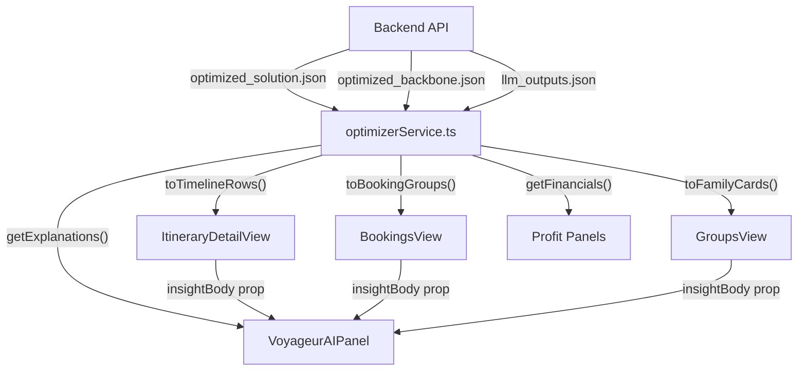

# Frontend Data Integration Report: Backend JSON → UI Components

## Overview

The backend optimizer pipeline produces **3 JSON files** per scenario. The frontend currently uses **fully hardcoded mock data** with no TypeScript interfaces or data-fetching logic matching these schemas. This report maps every backend field to the frontend components that should consume it, identifies gaps, and proposes the changes needed.

---

## 1. Backend Data Schemas

### 1.1 `optimized_solution.json` — The Core Itinerary

The primary output. Contains the full multi-family, multi-day optimized trip.

| Field Path | Type | Description | Frontend Target |
|---|---|---|---|
| `trip_id` | `string` | Unique trip identifier | **ItineraryDetailView** header, **ItineraryOptimizerWindow** card |
| `families[]` | `string[]` | List of family IDs (e.g. `"FAM_A"`) | **GroupsView** sidebar, all family filters |
| `total_trip_cost` | `number` | Sum of all transport costs across all days | **BookingsView** "Total Manifest Cost", profit panels |
| `total_trip_time_min` | `number` | Total transport time in minutes | Profit/insights panels |
| `days[]` | `DayData[]` | Array of per-day data (see below) | **ItineraryDetailView** timeline rows |

#### Per-Day (`days[n]`):

| Field | Type | Maps To |
|---|---|---|
| `day` | `number` | Day header ("Day 01", "Day 02") |
| `objective_value` | `number` | AI insight panel (optimization score) |
| `solve_time_seconds` | `number` | AI panel diagnostic info |
| `shared_poi_order[]` | `string[]` | Shared anchor POIs shown as group-level activities |
| `total_transport_cost` | `number` | **BookingsView** per-day cost, profit panel |
| `total_transport_time_min` | `number` | Day header metadata |
| `num_families` | `number` | Day header badge |

#### Per-Family-Per-Day (`days[n].families.FAM_X`):

| Field | Type | Maps To |
|---|---|---|
| `family_id` | `string` | **GroupsView** family cards, participant chips |
| `total_satisfaction` | `number` | **GroupsView** sentiment indicator, AI insights |
| `pois[]` | `POI[]` | **ItineraryDetailView** activity cards |
| `transport[]` | `Transport[]` | **BookingsView** transport entries |

#### POI Entry (`pois[n]`):

| Field | Type | Maps To |
|---|---|---|
| `sequence` | `number` | Card ordering in timeline |
| `location_id` | `string` | Location code on card (`PARIS_01` → `LOC_007`) |
| `location_name` | `string` | Activity card title |
| `arrival_time` | `string` (HH:MM) | Time column in timeline |
| `departure_time` | `string` (HH:MM) | Duration calculation |
| `visit_duration_min` | `number` | Duration label on card |
| `satisfaction_score` | `number` | Satisfaction badge / color gradient |

#### Transport Entry (`transport[n]`):

| Field | Type | Maps To |
|---|---|---|
| `from` / `to` | `string` | Transport description |
| `from_name` / `to_name` | `string` | Human-readable labels |
| `mode` | `string` (METRO/BUS/CAB_FALLBACK) | **BookingsView** transport icon + tag |
| `duration_min` | `number` | Duration display |
| `cost` | `number` | Per-entry price |

---

### 1.2 `optimized_backbone.json` — Hotels, Skeleton Routes, Restaurants

Infrastructure assignments that don't change per-optimization run.

| Field Path | Type | Maps To |
|---|---|---|
| `hotel_assignments.FAM_X[].day` | `number` | **BookingsView** hotel booking entries |
| `hotel_assignments.FAM_X[].hotel_id` | `string` | Hotel booking reference ID |
| `hotel_assignments.FAM_X[].hotel_name` | `string` | Hotel booking title |
| `hotel_assignments.FAM_X[].cost` | `number` | Hotel booking price |
| `skeleton_routes.{day}[]` | `string[]` | Shared anchor POIs (informational) |
| `daily_restaurants.{day}.dinner` | `string` | Restaurant booking entries in **BookingsView** |

---

### 1.3 `llm_outputs.json` — AI Agent Pipeline Output

Contains the full AI reasoning chain and human-readable explanations.

| Field Path | Type | Maps To |
|---|---|---|
| `scenario_number` | `number` | Version tracking |
| `scenario_name` | `string` | AI panel header |
| `user_input` | `string` | Chat history / activity log |
| `feedback_agent.output.event_type` | `string` | Activity log badge |
| `feedback_agent.output.confidence` | `string` | Confidence indicator |
| `feedback_agent.output.poi_name` | `string` | Activity log title |
| `decision_agent.output.action` | `string` | System activity type |
| `decision_agent.output.reason` | `string` | Activity log body |
| `optimizer_triggered` | `boolean` | System status indicator |
| `explainability_agent.explanations[]` | `Explanation[]` | **VoyageurAIPanel** insight body |

#### Explanation Entry:

| Field | Type | Maps To |
|---|---|---|
| `audience` | `"FAMILY"` / `"TRAVEL_AGENT"` | Determines which panel shows it |
| `explanation` | `string` | **VoyageurAIPanel** insight body (FAMILY audience), **GroupsView** activity log (TRAVEL_AGENT audience) |
| `family_id` | `string?` | Filter to show family-specific explanation |

---

## 2. Gap Analysis: Current Frontend vs Backend Data

### 2.1 Component-Level Gaps

| Component | Current State | What's Missing |
|---|---|---|
| **ItineraryDetailView** | Hardcoded `TIMELINE_ROWS` with 3 Paris activities | Needs to consume `days[].families.FAM_X.pois[]` dynamically. Must support N days with day selector. Must render split/merge based on which families share POIs. |
| **BookingsView** | Hardcoded `BOOKINGS_DATA` with flights/hotels/dining | Needs to consume `transport[]` (per family per day), hotel assignments from backbone, and restaurant assignments. No flight data in optimizer output — flights are separate. |
| **GroupsView** | Hardcoded `FAMILIES` array with 6 dummy families | Needs to map `optimized_solution.families[]` to family cards. Satisfaction scores should drive sentiment dots. Activity log should consume `llm_outputs.json` events. |
| **VoyageurAIPanel** | Hardcoded insight body, dummy `getAIReply` | Should render `explainability_agent.explanations[]` as insight content. Family-audience explanations per selected family. Travel-agent explanation in the main panel. |
| **ItineraryOptimizerWindow** | Uses `TRIPS` from `lib/trips.ts` | Trip cards are independent of optimizer data — this component is mostly fine as-is. Could show `total_trip_cost` and `total_trip_time_min` on the card. |

### 2.2 Missing TypeScript Interfaces

None of the backend JSON schemas have corresponding TypeScript interfaces in the frontend. The existing `types.ts` has `Booking`, `Family`, `TripRequest` etc. but they don't match the optimizer output format.

### 2.3 Missing Data Layer

- No API service or data-fetching hooks exist for optimizer outputs
- No state management for the active scenario's data
- The `getTripById()` function returns static mock data

---

## 3. Proposed Changes

### TypeScript Types

#### [NEW] [optimizerTypes.ts](file:///c:/Amlan/Codes/Voyageur_Studio/frontend/lib/optimizer/optimizerTypes.ts)

New file with complete TypeScript interfaces matching all 3 JSON schemas:
- `OptimizedSolution` — root interface for `optimized_solution.json`
- `SolutionDay`, `FamilySolution`, `POIVisit`, `TransportLeg`
- `OptimizedBackbone`, `HotelAssignment`, `SkeletonRoutes`, `DailyRestaurants`  
- `LLMOutputs`, `FeedbackAgentOutput`, `DecisionAgentOutput`, `ExplainabilityExplanation`

---

### Data Service

#### [NEW] [optimizerService.ts](file:///c:/Amlan/Codes/Voyageur_Studio/frontend/lib/optimizer/optimizerService.ts)

Utility functions to:
- Parse and validate the 3 JSON files
- Transform `OptimizedSolution` → `TimeRow[]` for ItineraryDetailView
- Transform `OptimizedSolution` + `OptimizedBackbone` → `DayGroup[]` (BookingsView format)
- Transform `OptimizedSolution.families` → `Family[]` (GroupsView format)
- Extract family/agent explanations from `LLMOutputs`
- Compute aggregate financial metrics (total cost, savings, satisfaction deltas)

---

### Component Updates

#### [MODIFY] [ItineraryDetailView.tsx](file:///c:/Amlan/Codes/Voyageur_Studio/frontend/components/itinerary/ItineraryDetailView.tsx)

- Add optional props: `optimizedSolution?: OptimizedSolution`, `llmOutputs?: LLMOutputs`
- When props are provided, replace `TIMELINE_ROWS` with dynamically generated rows from `optimizedSolution.days[]`
- Add a day selector tab bar for multi-day support
- Map POI's `location_id` to `locationCode`, compute `durationLabel` from `visit_duration_min`
- Show per-family participant chips based on which families visit each POI
- Show split/merge indicators when families diverge
- Populate VoyageurAIPanel with `llmOutputs.explainability_agent.explanations`

#### [MODIFY] [BookingsView.tsx](file:///c:/Amlan/Codes/Voyageur_Studio/frontend/components/itinerary/BookingsView.tsx)

- Add optional props: `optimizedSolution?: OptimizedSolution`, `backbone?: OptimizedBackbone`
- When props are provided, replace `BOOKINGS_DATA` with dynamically built booking rows:
  - Hotel bookings from `backbone.hotel_assignments`
  - Transport entries from `optimizedSolution.days[].families.FAM_X.transport[]`
  - Dining/restaurant entries from dinner POIs + `backbone.daily_restaurants`
- Compute `Total Manifest Cost` from `optimizedSolution.total_trip_cost` + hotel costs
- Update profit panel with real financial data

#### [MODIFY] [GroupsView.tsx](file:///c:/Amlan/Codes/Voyageur_Studio/frontend/components/itinerary/GroupsView.tsx)

- Add optional props: `optimizedSolution?: OptimizedSolution`, `llmOutputs?: LLMOutputs`
- When props are provided, replace `FAMILIES` with dynamically built family cards:
  - Family ID → family name mapping
  - Satisfaction scores → sentiment dots (thresholds: >8 happy, 5-8 neutral, <5 unhappy)
  - POI count, hotel name as tags
- Replace `ACTIVITY_LOG` with entries from `llmOutputs`:
  - `feedback_agent.output` → request activity
  - `decision_agent.output` → system activity
  - `explainability_agent.explanations[audience=TRAVEL_AGENT]` → review activity

#### [MODIFY] [VoyageurAIPanel.tsx](file:///c:/Amlan/Codes/Voyageur_Studio/frontend/components/itinerary/VoyageurAIPanel.tsx)

- No structural changes needed — the panel is already prop-driven
- Parent components will pass real `insightBody` and `getAIReply` from `llmOutputs`

#### [MODIFY] [ItineraryOptimizerWindow.tsx](file:///c:/Amlan/Codes/Voyageur_Studio/frontend/components/itinerary/ItineraryOptimizerWindow.tsx)

- Minimal changes — add optional `optimizedSolution` prop to TripCard to show real cost/time
- Could display `total_trip_cost` and `num_families` on card footer

---

## 4. Data Flow Diagram

---

## 5. Verification Plan

### Browser Verification
- Run `npm run dev` and navigate to the itinerary management pages
- Confirm components render without errors when optimizer data props are passed
- Confirm components still render correctly with mock data when no optimizer props are provided (backward compatibility)

### Manual Verification
- Compare rendered POI cards in **ItineraryDetailView** against `optimized_solution.json` POI entries (names, times, durations should match)
- Compare transport entries in **BookingsView** against `optimized_solution.json` transport arrays
- Verify family satisfaction scores in **GroupsView** align with JSON values
- Verify AI explanations in **VoyageurAIPanel** match `llm_outputs.json` content

> [!IMPORTANT]
> Since this is a frontend-only change with no backend API connected yet, all testing will be done with imported JSON files as mock data. The components will maintain backward compatibility — when no optimizer props are passed, they fall back to the existing hardcoded mock data.
