# Meili-AI (MerYDiaN) — Frontend Architecture Guide

> **Framework**: Next.js 15 (App Router) · **Styling**: Tailwind CSS · **State**: React Context (AuthContext)  
> **Root**: `frontend/`

---

## 1. High-Level Folder Structure

```
frontend/
├── app/                    # Next.js App Router — all routes live here
│   ├── layout.tsx          # Root layout (fonts, AuthProvider wrapper)
│   ├── page.tsx            # "/" landing page
│   ├── globals.css         # Global styles
│   └── [route-dirs]/       # Each directory = a URL route
├── components/             # Shared, reusable components (non-route)
│   ├── landing/            # Landing page sections
│   ├── itinerary/          # Itinerary views used by agent & customer
│   ├── charts/             # Chart components (Intelligence page)
│   ├── chat/               # AgentChatPanel
│   ├── common/             # Navigation, breadcrumbs, progress bars
│   ├── ui/                 # Generic UI primitives (Sidebar, AppIcon, etc.)
│   └── demo/               # Demo dashboard components
├── contexts/               # React Contexts
│   └── AuthContext.tsx      # Auth state, login/signup/logout, JWT decode
├── services/               # API & backend service clients
│   ├── api.ts              # Core API client (login, signup, refresh, CRUD)
│   ├── itinerary.service.ts
│   ├── map.service.ts
│   ├── media.service.ts
│   ├── poi.service.ts
│   └── websocket.service.ts
├── hooks/                  # Custom React hooks
├── lib/                    # Utilities, data files, helper functions
├── types/                  # TypeScript type definitions
├── sockets/                # WebSocket configuration
└── public/                 # Static assets (images, icons, frames)
```

---

## 2. Root Layout & Auth Flow

### [layout.tsx](file:///c:/Users/Lenovo/OneDrive/Desktop/Coding/Projects/Meili-AI/Meili-AI/frontend/app/layout.tsx)

Every page is wrapped by:
```
<AuthProvider>     ← from contexts/AuthContext.tsx
  {children}       ← route pages
</AuthProvider>
```

### Auth Redirect Rules (in `AuthContext.tsx`)

| Action | Agent Role | Customer (Traveller) Role |
|--------|-----------|--------------------------|
| After **login** | → `/agent-dashboard` | → `/customer-portal` |
| After **signup** | → `/agent-dashboard` | → `/customer-portal` |
| After **logout** | → `/login` | → `/login` |

---

## 3. Complete Route Map

### 🏠 Public / Landing

| Route | File | Renders | Description |
|-------|------|---------|-------------|
| `/` | `app/page.tsx` | `<LandingPage />` from `components/LandingPage.tsx` | Marketing landing page |
| `/signup` | `app/signup/page.tsx` | Self-contained (inline) | Signup form (customer or agent toggle) |
| `/customer-login` | `app/customer-login/page.tsx` | `<CustomerLoginInteractive />` from `./components/` | Customer login (Family ID based) |
| `/agent-login` | `app/agent-login/page.tsx` | `<AgentLoginInteractive />` from `./components/` | Travel agent login |

---

### 👤 Customer Portal (Post-Login)

| Route | File | Renders | Description |
|-------|------|---------|-------------|
| `/customer-portal` | `app/customer-portal/page.tsx` | `<EnhancedCustomerPortalInteractive />` | Main customer hub — trips, family, chat |
| `/customer-dashboard` | `app/customer-dashboard/page.tsx` | `<CustomerDashboardInteractive />` | Alternate customer dashboard view |
| `/customer-bookings` | `app/customer-bookings/page.tsx` | Self-contained + `<BookingCard />`, `<BookingDetailsModal />`, `<CustomerSidebar />` | View/filter all bookings |
| `/customer-preference` | `app/customer-preference/page.tsx` | `<PreferenceBuilderInteractive />` | Interest/preference calibration |
| `/customer-trip-request` | `app/customer-trip-request/page.tsx` | `<CustomerProgressIndicator />` + `<TripRequestInteractive />` | Multi-step trip request form |
| `/customer-itinerary-view` | `app/customer-itinerary-view/page.tsx` | `<CustomerProgressIndicator />` + `<CustomerItineraryInteractive />` | Review AI-generated itinerary |
| `/customer-itinerary/[tripId]` | `app/customer-itinerary/[tripId]/page.tsx` | `<ItineraryView />` from `components/itinerary/` | View specific trip itinerary |
| `/itinerary-selection` | `app/itinerary-selection/page.tsx` | Self-contained | Choose a curated itinerary skeleton |
| `/trip/[id]` | `app/trip/[id]/page.tsx` | `<TripHeader />` + `<AgentChatPanel />` | Trip detail with chat assistant |

---

### 🧳 Agent Dashboard (Post-Login)

| Route | File | Renders | Description |
|-------|------|---------|-------------|
| `/agent-dashboard/itinerary-management` | `app/agent-dashboard/itinerary-management/page.tsx` | `<NavigationBreadcrumbs />` + `<ItineraryOptimizerWindow />` | Trip list & management hub |
| `/agent-dashboard/itinerary-management/new` | `…/new/page.tsx` | Self-contained | Create new itinerary (families + days + events) |
| `/agent-dashboard/itinerary-management/[tripId]` | `…/[tripId]/page.tsx` | `<ItineraryDetailView />` | Detailed trip timeline & optimization |
| `/agent-dashboard/itinerary-management/[tripId]/bookings` | `…/bookings/page.tsx` | `<BookingsView />` | Manage trip bookings |
| `/agent-dashboard/itinerary-management/[tripId]/groups` | `…/groups/page.tsx` | `<GroupsView />` | Manage trip groups & families |
| `/agent-dashboard/itinerary-management/[tripId]/intelligence` | `…/intelligence/page.tsx` | `<IntelligenceView />` | Analytics charts for the trip |
| `/agent-dashboard/itinerary-builder` | `app/agent-dashboard/itinerary-builder/page.tsx` | `<NavigationBreadcrumbs />` + `<ItineraryBuilderView />` | Drag-and-drop itinerary builder |
| `/agent-request-review` | `app/agent-request-review/page.tsx` | `<AgentWorkflowTabs />` + `<NavigationBreadcrumbs />` + `<AgentRequestReviewInteractive />` | Review customer trip requests |
| `/optimizer` | `app/optimizer/page.tsx` | `<EditorInteractive />` | Detailed itinerary editor with cost analysis |
| `/analytics` | `app/analytics/page.tsx` | `<Sidebar />` + `<NavigationBreadcrumbs />` + inline stats | Revenue & analytics dashboard |

#### Agent `[tripId]` Layout

The route `/agent-dashboard/itinerary-management/[tripId]/` has its own [layout.tsx](file:///c:/Users/Lenovo/OneDrive/Desktop/Coding/Projects/Meili-AI/Meili-AI/frontend/app/agent-dashboard/itinerary-management/%5BtripId%5D/layout.tsx) that wraps all sub-pages with:

```
<NavigationBreadcrumbs />
<TripDetailNavbar tripId={tripId} />   ← Tab navigation (Itinerary | Bookings | Groups | Intelligence)
{children}
```

---

### 🔬 Demo Section

| Route | File | Renders | Description |
|-------|------|---------|-------------|
| `/demo` | `app/demo/page.tsx` | `<Dashboard />` from `components/demo/` | Demo dashboard |
| `/demo/analytics` | `app/demo/analytics/page.tsx` | Demo analytics |
| `/demo/families` | `app/demo/families/page.tsx` | Demo families list |
| `/demo/family/[id]` | `app/demo/family/[id]/page.tsx` | Demo family detail |

The demo section has its own [layout.tsx](file:///c:/Users/Lenovo/OneDrive/Desktop/Coding/Projects/Meili-AI/Meili-AI/frontend/app/demo/layout.tsx) with `<Sidebar />` + `<TopNav />` (from `components/demo/`).

---

### 🚧 Placeholder Routes (Stub Pages — "Coming Soon")

| Route | File |
|-------|------|
| `/dashboard` | `app/dashboard/page.tsx` |
| `/bookings` | `app/bookings/page.tsx` |
| `/itinerary` | `app/itinerary/page.tsx` |
| `/map` | `app/map/page.tsx` |
| `/agent/dashboard` | `app/agent/dashboard/page.tsx` |
| `/poi/[poiId]` | `app/poi/[poiId]/page.tsx` |
| `/neumorphic-demo` | `app/neumorphic-demo/page.tsx` |

---

## 4. Component Dependency Map

### How Components Connect

```mermaid
graph TD
    subgraph "Root"
        Layout["layout.tsx<br/>(AuthProvider)"]
    end

    subgraph "Public"
        LP["/ → LandingPage"]
        CL["customer-login → CustomerLoginInteractive"]
        AL["agent-login → AgentLoginInteractive"]
        SU["signup → (inline form)"]
    end

    subgraph "Customer Portal"
        CP["customer-portal → EnhancedCustomerPortalInteractive"]
        CB["customer-bookings → BookingCard + CustomerSidebar"]
        CPref["customer-preference → PreferenceBuilderInteractive"]
        CTR["customer-trip-request → TripRequestInteractive"]
        CIV["customer-itinerary-view → CustomerItineraryInteractive"]
        CI["customer-itinerary/tripId → ItineraryView"]
    end

    subgraph "Agent Dashboard"
        AIM["itinerary-management → ItineraryOptimizerWindow"]
        AID["tripId → ItineraryDetailView"]
        AIB["tripId/bookings → BookingsView"]
        AIG["tripId/groups → GroupsView"]
        AII["tripId/intelligence → IntelligenceView"]
        AINew["new → (inline form)"]
        AB["itinerary-builder → ItineraryBuilderView"]
        ARR["agent-request-review → AgentRequestReviewInteractive"]
        OPT["optimizer → EditorInteractive"]
    end

    Layout --> LP
    Layout --> CL
    Layout --> AL
    Layout --> CP
    Layout --> AIM

    LP --> Header["components/landing/Header"]
    LP --> Hero["components/landing/HeroSection"]
    LP --> Features["components/landing/FeaturesSection"]
    LP --> Footer["components/landing/Footer"]

    CP --> TripCard["EnhancedTripCard"]
    CP --> ChatModal["EnhancedAgentChatModal"]
    CP --> PlanTrip["PlanTripModal"]

    CTR --> DestSel["DestinationSelector"]
    CTR --> DatePick["DateRangePicker"]
    CTR --> BudgetSldr["BudgetRangeSlider"]
    CTR --> GroupComp["GroupComposition"]
    CTR --> TravPref["TravelerPreferences"]

    AID --> TimelineCard["TimelineEventCard"]
    AID --> TicketModal["TicketModal"]
    AID --> VoyageurAI["VoyageurAIPanel"]

    AII --> Charts["charts/*"]
```



---

## 5. Shared Components Reference

### Navigation Components (`components/common/`)

| Component | Used By | Purpose |
|-----------|---------|---------|
| `NavigationBreadcrumbs` | Agent pages (itinerary-mgmt, analytics, request-review) | Contextual breadcrumb trail |
| `CustomerProgressIndicator` | `customer-trip-request`, `customer-itinerary-view` | Multi-step progress bar (draft → in-review → approved) |
| `AgentWorkflowTabs` | `agent-request-review` | Tab bar for the agent workflow |
| `AgentNavigation` | Agent pages | Agent-specific nav links |
| `CustomerNavigation` | Customer pages | Customer-specific nav links |
| `RoleBasedNavigation` | — | Switches between Agent/Customer nav |

### Sidebar Components

| Component | Location | Used By |
|-----------|----------|---------|
| `CustomerSidebar` | `app/components/CustomerSidebar.tsx` | `customer-bookings` |
| `Sidebar` (Agent) | `components/ui/Sidebar.tsx` | `analytics`, agent tripId layout |
| `Sidebar` (Demo) | `components/demo/Sidebar.tsx` | Demo layout |

### Itinerary Components (`components/itinerary/`)

| Component | Used By |
|-----------|---------|
| `ItineraryOptimizerWindow` | `/agent-dashboard/itinerary-management` (trip list) |
| `ItineraryDetailView` | `/agent-dashboard/…/[tripId]` (timeline detail) |
| `ItineraryBuilderView` | `/agent-dashboard/itinerary-builder` |
| `ItineraryView` | `/customer-itinerary/[tripId]` (customer view) |
| `BookingsView` | `…/[tripId]/bookings` |
| `GroupsView` | `…/[tripId]/groups` |
| `IntelligenceView` | `…/[tripId]/intelligence` |
| `TripDetailNavbar` | `[tripId]` layout (tab navigation) |
| `TimelineEventCard` | Used within `ItineraryDetailView` |
| `VoyageurAIPanel` | Used within `ItineraryDetailView` |
| `TicketModal` | Used within `BookingsView` |

### Chart Components (`components/charts/`)

| Component | Purpose |
|-----------|---------|
| `DisruptionImpactChart` | Disruption impact simulation |
| `FamilyAnalysisRadarChart` | Family analysis metrics radar |
| `FamilyCostStackedChart` | Cost breakdown per family |
| `PersonalizationProfitChart` | Personalization vs. profit analysis |

### Landing Page Components (`components/landing/`)

| Component | Purpose |
|-----------|---------|
| `Header` | Top navbar with CTA buttons |
| `HeroSection` | Hero with parallax animation |
| `FeaturesSection` | Feature cards grid |
| `AISupportSection` | AI capabilities showcase |
| `AnalyticsSection` | Analytics demo visuals |
| `PricingSection` | Pricing tiers |
| `TestimonialSection` | User testimonials |
| `Footer` | Site footer |

---

## 6. Key Navigation Flows

### Customer Journey
```
Landing (/) 
  → Sign Up (/signup) or Customer Login (/customer-login)
    → Customer Portal (/customer-portal)
      ├── View Trips → Itinerary (/customer-itinerary/[tripId])
      ├── Plan New Trip → Itinerary Selection (/itinerary-selection)
      │     → Trip Request Form (/customer-trip-request)
      │       → Itinerary Review (/customer-itinerary-view)
      ├── View Bookings (/customer-bookings)
      ├── Set Preferences (/customer-preference)
      └── Trip Detail with Chat (/trip/[id])
```

### Agent Journey
```
Landing (/) 
  → Agent Login (/agent-login)
    → Itinerary Management (/agent-dashboard/itinerary-management)
      ├── Create New Trip (/agent-dashboard/itinerary-management/new)
      ├── Select Trip → Trip Detail (…/[tripId])
      │     ├── Tab: Itinerary (…/[tripId])
      │     ├── Tab: Bookings (…/[tripId]/bookings)
      │     ├── Tab: Groups (…/[tripId]/groups)
      │     └── Tab: Intelligence (…/[tripId]/intelligence)
      └── Itinerary Builder (/agent-dashboard/itinerary-builder)
    → Review Customer Requests (/agent-request-review)
    → Itinerary Editor (/optimizer)
    → Analytics (/analytics)
```

---

## 7. Data Flow & Services

### API Client (`services/api.ts`)

The centralized API client handles all backend communication:
- **Auth**: `login()`, `signup()`, `logout()`, `refreshToken()`
- **Trips**: CRUD operations for trips/itineraries
- **Token management**: Auto-sets JWT on requests, auto-refresh every 25 minutes

### Data Sources (Current — Mostly Mock)

Many pages currently load data from local JSON files:
- `lib/agent-dashboard/data/itinerary_data.json` — itinerary data
- `lib/agent-dashboard/data/active_groups.json` — active group trips
- `lib/agent-dashboard/data/upcoming_groups.json` — upcoming group trips

> [!IMPORTANT]
> **For backend integration**: Replace these JSON imports with API calls through `services/api.ts`. The data structures in these JSON files define the expected shape of your API responses.

### Session Storage Keys

| Key | Set By | Used By |
|-----|--------|---------|
| `familyId` | Customer login | `customer-bookings`, `customer-itinerary` |
| `familyGroupMap` | Customer login | `customer-bookings`, `customer-itinerary` |
| `access_token` (localStorage) | `AuthContext` | All authenticated requests |
| `agent_mock_trips` (localStorage) | New itinerary form | Agent dashboard |

---

## 8. Customer Portal Component Breakdown

The `/customer-portal` page ([EnhancedCustomerPortalInteractive.tsx](file:///c:/Users/Lenovo/OneDrive/Desktop/Coding/Projects/Meili-AI/Meili-AI/frontend/app/customer-portal/components/EnhancedCustomerPortalInteractive.tsx)) is the most complex customer-facing component. It uses these sub-components:

| Sub-Component | File | Purpose |
|---------------|------|---------|
| `EnhancedTripCard` | `./EnhancedTripCard.tsx` | Trip card with actions (view, suggest change, report issue) |
| `EnhancedAgentChatModal` | `./EnhancedAgentChatModal.tsx` | Full agent chat modal |
| `PlanTripModal` | `./PlanTripModal.tsx` | "Plan a Trip" creation modal |
| `SuggestChangeModal` | `./SuggestChangeModal.tsx` | Suggest changes to itinerary |
| `ReportIssueModal` | `./ReportIssueModal.tsx` | Report an issue modal |
| `FamilyMemberCard` | `./FamilyMemberCard.tsx` | Family member display card |
| `DetailedItineraryModal` | `./DetailedItineraryModal.tsx` | Detailed itinerary preview |

---

## 9. Trip Request Form Components

The `/customer-trip-request` form ([TripRequestInteractive.tsx](file:///c:/Users/Lenovo/OneDrive/Desktop/Coding/Projects/Meili-AI/Meili-AI/frontend/app/customer-trip-request/components/TripRequestInteractive.tsx)) orchestrates a multi-step wizard using:

| Step | Component | File |
|------|-----------|------|
| 1 | `DestinationSelector` | `./components/DestinationSelector.tsx` |
| 2 | `DateRangePicker` | `./components/DateRangePicker.tsx` |
| 3 | `BudgetRangeSlider` | `./components/BudgetRangeSlider.tsx` |
| 4 | `GroupComposition` | `./components/GroupComposition.tsx` |
| 5 | `TravelerPreferences` | `./components/TravelerPreferences.tsx` |
| 6 | `PlacePreferences` | `./components/PlacePreferences.tsx` |
| — | `ProgressIndicator` | `./components/ProgressIndicator.tsx` |
