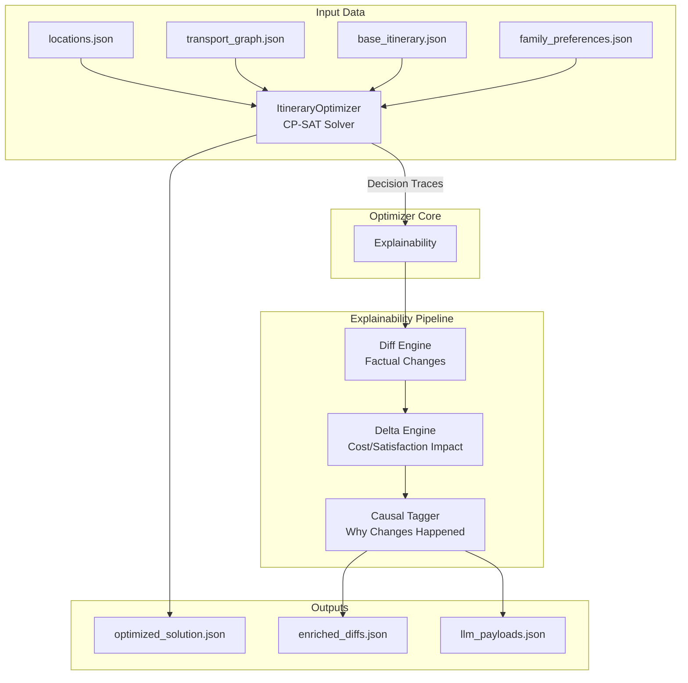
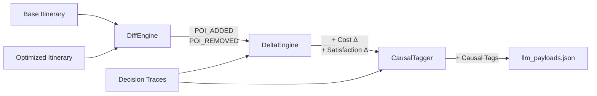
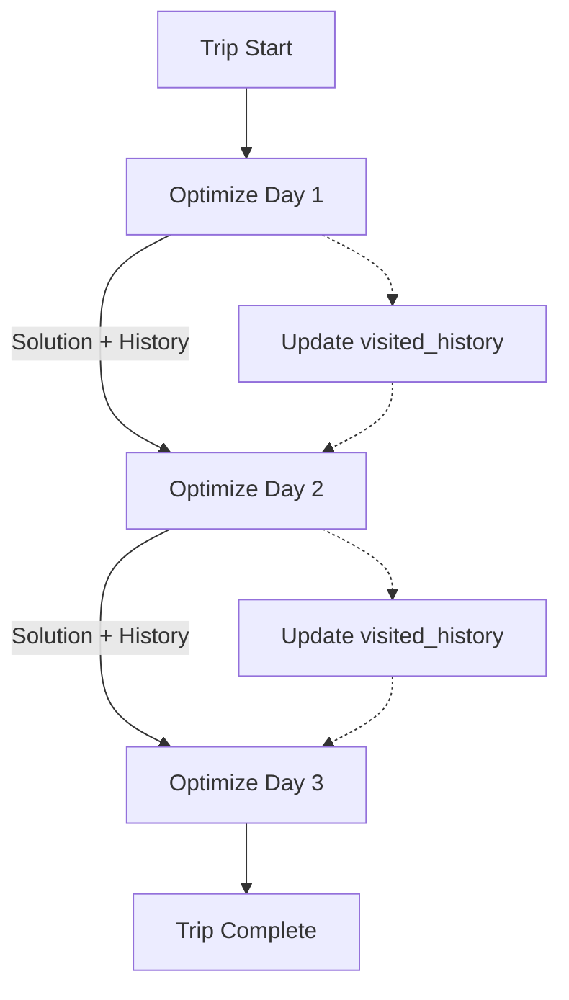
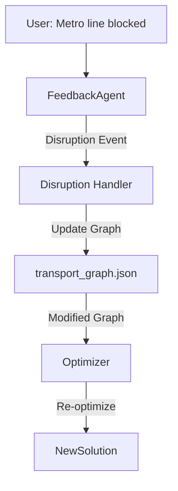

# ML/OR Optimizer: Architecture, Features, and Working Principles

> **Document Purpose**: Comprehensive technical reference for the ML/OR itinerary optimizer, documenting current architecture, core features, and extension points for future enhancements.
>
> **Last Updated**: 2026-02-13  
> **Status**: Production-Ready

---

## Table of Contents

1. [System Overview](#system-overview)
2. [Architecture Deep Dive](#architecture-deep-dive)
3. [Optimization Engine](#optimization-engine)
4. [Core Features](#core-features)
5. [Explainability System](#explainability-system)
6. [Data Model Specification](#data-model-specification)
7. [Current Workflow](#current-workflow)
8. [Future Extension Points](#future-extension-points)
9. [Technical Details](#technical-details)
10. [Common Patterns and Gotchas](#common-patterns-and-gotchas)

---

## System Overview

### Purpose

The **ML/OR Optimizer** is a production-ready, constraint-based itinerary optimization system that personalizes group travel schedules while maintaining group coherence. It treats personalization as **deviation from a base itinerary** rather than independent route planning.

### Design Philosophy

```
Base Itinerary (Shared Skeleton)
         ↓
    + Family Preferences (Interest Vectors, Must-Visit, Never-Visit)
         ↓
    Optimization (CP-SAT Constraint Solver)
         ↓
    Personalized Itineraries (with Coherence Penalties)
         ↓
    Explainability (Diff → Delta → Causal Tags)
```

**Key Principles**:
- **Deviation-Based Optimization**: Optimize changes from base itinerary, not full replanning
- **Joint POI + Transport**: Optimize POI selection and transport modes simultaneously
- **Coherence Loss**: Penalize divergence from group to maintain synchronization
- **Deterministic Explainability**: Non-LLM authority layer for causal reasoning

### High-Level Architecture



---

## Architecture Deep Dive

### Core Components

#### 1. **ItineraryOptimizer** ([itinerary_optimizer.py](file:///c:/Amlan/Codes/Voyageur_Studio/ml_or/itinerary_optimizer.py))

The main optimization engine (1706 lines) implementing CP-SAT constraint programming.

**Key Responsibilities**:
- Load and validate input data
- Build constraint programming model
- Solve optimization problem
- Extract and format solution
- Generate decision traces

**Main Methods**:

| Method | Purpose | Scope |
|--------|---------|-------|
| [`optimize_single_family_single_day`](file:///c:/Amlan/Codes/Voyageur_Studio/ml_or/itinerary_optimizer.py#L329) | Optimize for 1 family, 1 day | Simplified, used for testing |
| [`optimize_multi_family_single_day`](file:///c:/Amlan/Codes/Voyageur_Studio/ml_or/itinerary_optimizer.py#L995) | Optimize for N families, 1 day | Current production method |
| [`optimize_trip`](file:///c:/Amlan/Codes/Voyageur_Studio/ml_or/itinerary_optimizer.py#L938) | Optimize full multi-day trip | Loops through days |

**Decision Variables**:
- `x[f,i]` ∈ {0,1}: Family `f` visits POI `i`
- `y[i,j]` ∈ {0,1}: Skeleton POI `i` before `j` (shared ordering)
- `adj[f,i,j]` ∈ {0,1}: Family `f` travels from `i` to `j` (family-specific routing)
- `arr[f,i]`, `dep[f,i]` ∈ ℤ: Arrival/departure times (minutes since midnight)

#### 2. **Explainability Modules** ([explainability/](file:///c:/Amlan/Codes/Voyageur_Studio/ml_or/explainability))

**[ItineraryDiffEngine](file:///c:/Amlan/Codes/Voyageur_Studio/ml_or/explainability/diff_engine.py)** (170 lines)
- Computes factual differences between base and optimized itineraries
- Detects POI_ADDED, POI_REMOVED, POI_RESCHEDULED events
- Deterministic, no AI involved

**[DeltaEngine](file:///c:/Amlan/Codes/Voyageur_Studio/ml_or/explainability/delta_engine.py)** (230 lines)
- Enriches diffs with quantitative impact metrics
- Calculates marginal transport costs for each POI change
- Computes satisfaction delta per change
- Attributes entrance fees and visit durations

**[CausalTagger](file:///c:/Amlan/Codes/Voyageur_Studio/ml_or/explainability/causal_tagger.py)** (77 lines)
- Assigns causal tags to changes using decision traces
- Deterministic inference based on constraint logs
- Tags: `HISTORY_BAN`, `INTEREST_VECTOR_DOMINANCE`, `SHARED_ANCHOR_REQUIRED`, `LOW_INTEREST_DROPPED`, `OBJECTIVE_DOMINATED`

#### 3. **Data Structures** ([itinerary_optimizer.py:L52-93](file:///c:/Amlan/Codes/Voyageur_Studio/ml_or/itinerary_optimizer.py#L52-L93))

```python
@dataclass
class Location:
    location_id: str
    name: str
    type: str  # POI, HOTEL, RESTAURANT, TRANSPORT_HUB
    category: str
    lat: float
    lng: float
    avg_visit_time_min: int
    cost: float  # Entrance fee
    repeatable: bool
    tags: List[str]  # For interest matching
    base_importance: float
    role: str = "SKELETON"  # SKELETON (shared) or BRANCH (optional)

@dataclass
class TransportEdge:
    edge_id: str
    from_loc: str
    to_loc: str
    mode: str  # BUS, METRO, CAB, WALK, CAB_FALLBACK
    duration_min: int
    cost: float
    reliability: float

@dataclass
class FamilyPreference:
    family_id: str
    members: int
    children: int
    budget_sensitivity: float
    energy_level: float
    interest_vector: Dict[str, float]  # e.g., {"HISTORY": 0.9, "NATURE": 0.3}
    must_visit_locations: List[str]
    never_visit_locations: List[str]
    pace_preference: str = "moderate"
    notes: str = ""
```

---

## Optimization Engine

### CP-SAT Constraint Programming

The optimizer uses **Google OR-Tools CP-SAT** solver for combinatorial optimization.

**Why CP-SAT?**
- Handles both discrete (POI selection) and continuous (time scheduling) variables
- Efficient for small-to-medium problems (~12 POIs, 3 days, 3 families)
- Supports complex constraints (synchronization, time windows, ordering)
- Provides optimality guarantees within time limits

### Constraint Types

#### 1. **Time Constraints**
```
dep[f,i] = arr[f,i] + visit_time[i]
arr[f,j] ≥ dep[f,i] + transport_time[i→j]  (if edge i→j used)
day_start ≤ arr[f,i] ≤ day_end
```

#### 2. **Ordering Constraints**

**Skeleton Ordering** (Shared backbone for group synchronization):
```
y[i,j] = 1 ⇒ arr[f,j] ≥ dep[f,i]  ∀ families f
```

**Family-Specific Routing** (TSP-like flow):
```
Σ_i adj[f,i,node] = 1  (if node visited)  # Exactly one incoming edge
Σ_j adj[f,node,j] = 1  (if node visited)  # Exactly one outgoing edge
```

#### 3. **Preference Constraints**
```
x[f,i] = 1  if i ∈ must_visit[f]
x[f,i] = 0  if i ∈ never_visit[f]
x[f,i] = 0  if i ∈ visited_history[f] AND i.repeatable = False
```

#### 4. **Synchronization Constraints** (Strict for SKELETON POIs)
```
arr[f1, skeleton_poi] = arr[f2, skeleton_poi]  ∀ families f1, f2
```
This enforces that all families arrive at shared POIs simultaneously (e.g., taking the same bus).

#### 5. **Time Window Constraints** (Meal planning)
```
arr[f,lunch_poi] ≥ 12:30
dep[f,lunch_poi] ≤ 14:00
```

### Objective Function

**Maximize**:
```
Σ_f [ Satisfaction(f) − λ · CoherenceLoss(f) ]
```

**Satisfaction Scoring**:
```
Satisfaction(f, i) = base_importance[i] × (1 + Σ_tag interest_vector[f][tag] / |tags[i]|)
```

**Coherence Loss**:
```
CoherenceLoss(f) = α·TotalTime(f) + β·TotalCost(f) + γ·OrderDeviations(f)
```

**Weight Parameters** (Current defaults):
- `α = 1.0`: Time weight (1 minute = 1 satisfaction point)
- `β = 1.0`: Cost weight (₹1 = 1 satisfaction point)
- `γ = 100.0`: Order deviation weight (1 violation = 100 points)
- `λ = 0.3`: Coherence loss weight (coherence is 30% as important as satisfaction)

---

## Core Features

### 1. POI Classification System

**SKELETON POIs**:
- Shared anchor points for the group
- Ordered via `y[i,j]` variables
- Strict time synchronization enforced
- Typically: landmarks, group activities, hotels

**BRANCH POIs**:
- Family-specific optional stops
- Can be inserted between skeleton POIs
- Family-specific routing via `adj[f,i,j]`
- Typically: shopping, specialized interests

```python
# Example classification from locations.json
{
  "location_id": "LOC_001",
  "name": "Taj Mahal",
  "role": "SKELETON"  # Group visits together
}

{
  "location_id": "LOC_099",
  "name": "Local Craft Market",
  "role": "BRANCH"  # Optional for interested families
}
```

### 2. Dynamic Branch Expansion

**Algorithm** ([expand_branch_pois_for_day](file:///c:/Amlan/Codes/Voyageur_Studio/ml_or/itinerary_optimizer.py#L221)):
1. Calculate geographic centroid of skeleton POIs for the day
2. Filter `locations.json` for POIs within radius (default 5km)
3. Score each candidate by family interest vectors
4. Exclude POIs in `never_visit` lists
5. Return top N candidates (default 5)

**Purpose**: Automatically discover relevant optional POIs without manual curation.

### 3. Preference Management

**Interest Vector Matching**:
```python
# Family preference
interest_vector = {"HISTORY": 0.9, "NATURE": 0.3, "FOOD": 0.6}

# POI tags
poi_tags = ["HISTORY", "ARCHITECTURE"]

# Satisfaction calculation
tag_score = (0.9 + 0.0) / 2 = 0.45  # Average of matched tags
satisfaction = base_importance × (1 + 0.45)
```

**Must-Visit Enforcement**:
- Hard constraint: `x[f,poi] = 1`
- Guaranteed in solution
- Decision trace: `MUST_VISIT_CONSTRAINT`

**Never-Visit Enforcement**:
- Hard constraint: `x[f,poi] = 0`
- Excluded from candidate set
- Decision trace: `NEVER_VISIT_CONSTRAINT`

### 4. Transport Optimization

**Multi-Modal Selection**:
- Optimizer selects from available modes: BUS, METRO, CAB, WALK
- Chooses based on time-cost tradeoff
- Respects budget sensitivity per family

**Fallback CAB Generation** ([_create_fallback_transport](file:///c:/Amlan/Codes/Voyageur_Studio/ml_or/itinerary_optimizer.py#L194)):
```python
# When no explicit edge exists in transport_graph.json
distance_km = haversine_distance(loc1, loc2)
duration_min = max(10, distance_km / 25 * 60)  # 25 km/h city speed
cost = max(50, distance_km * 15)  # ₹15 per km, min ₹50
mode = "CAB_FALLBACK"
reliability = 0.85
```

**Purpose**: Ensure feasibility even with incomplete transport data.

### 5. History Tracking

**Multi-Day Visit Tracking** ([optimize_trip](file:///c:/Amlan/Codes/Voyageur_Studio/ml_or/itinerary_optimizer.py#L960-987)):
```python
visited_history: Dict[str, set] = {fid: set() for fid in family_ids}

# After each day:
for poi in day_result['families'][fid]['pois']:
    visited_history[fid].add(poi['location_id'])

# Next day constraint:
if poi in visited_history[fid] and not loc.repeatable:
    x[fid, poi] = 0  # Ban revisit
```

**Exception**: Skeleton POIs can be revisited if mandatory for that day's structure.

### 6. Coherence Loss System

**Order Deviation Penalty**:
```python
# If base order: [A, B, C]
# Optimized order: [A, C, B]
# Violations: (C→B) = 1 violation
# Penalty: 100 × 1 = 100 satisfaction points
```

**Purpose**: Encourage adherence to base itinerary structure unless strong preference justifies deviation.

---

## Explainability System

### Pipeline Flow



### Diff Engine Output Example

```json
{
  "FAM_001": {
    "2": [
      {"type": "POI_ADDED", "poi": "LOC_042"},
      {"type": "POI_REMOVED", "poi": "LOC_015"}
    ]
  }
}
```

### Delta Engine Enrichment

```json
{
  "FAM_001": {
    "2": [
      {
        "type": "POI_ADDED",
        "poi": "LOC_042",
        "cost_delta": {"entrance": 200, "transport": 150, "total": 350},
        "satisfaction_delta": 8.5,
        "transport_details": {
          "marginal_cost": 150,
          "marginal_time": 35,
          "mode": "METRO"
        }
      }
    ]
  }
}
```

### Causal Tagger Output

```json
{
  "type": "POI_ADDED",
  "poi": "LOC_042",
  "cost_delta": {...},
  "causal_tags": ["INTEREST_VECTOR_DOMINANCE", "SHARED_ANCHOR_REQUIRED"]
}
```

**Tag Definitions**:
- `HISTORY_BAN`: POI was visited on previous day and is non-repeatable
- `INTEREST_VECTOR_DOMINANCE`: Added due to high interest score match
- `SHARED_ANCHOR_REQUIRED`: Skeleton POI enforced for group synchronization
- `LOW_INTEREST_DROPPED`: Removed due to low family interest
- `OBJECTIVE_DOMINATED`: Change made due to optimizer tradeoff (time/cost/satisfaction)
- `HARD_TIME_WINDOW`: Constraint from meal planning or operating hours
- `MUST_VISIT_CONSTRAINT`: Explicitly requested by family
- `NEVER_VISIT_CONSTRAINT`: Explicitly excluded by family

### Decision Traces Structure

```python
self.decision_traces = {
    day_index: {
        "candidates": [
            {
                "family": "FAM_001",
                "day": 2,
                "candidates": [
                    {"poi_id": "LOC_042", "interest_score": 8.5, "role": "BRANCH"}
                ]
            }
        ],
        "constraints": [
            {
                "constraint_id": "HISTORY_BAN_FAM_001_LOC_010",
                "type": "HISTORY_BAN",
                "applies_to": {"family": "FAM_001", "poi": "LOC_010"}
            }
        ],
        "outcome": {...}  # Final solution
    }
}
```

---

## Data Model Specification

### Input Files

#### locations.json
```json
[
  {
    "location_id": "LOC_001",
    "name": "Taj Mahal",
    "type": "POI",
    "category": "MONUMENT",
    "lat": 27.1751,
    "lng": 78.0421,
    "avg_visit_time_min": 180,
    "cost": 250,
    "repeatable": false,
    "tags": ["HISTORY", "ARCHITECTURE", "UNESCO"],
    "base_importance": 9.5,
    "role": "SKELETON"
  }
]
```

#### transport_graph.json
```json
[
  {
    "edge_id": "EDGE_001_002_METRO",
    "from": "LOC_001",
    "to": "LOC_002",
    "mode": "METRO",
    "duration_min": 25,
    "cost": 40,
    "reliability": 0.95
  }
]
```

#### base_itinerary.json
```json
{
  "itinerary_id": "AGRA_3DAY",
  "assumptions": {
    "day_start_time": "09:00",
    "day_end_time": "18:00",
    "start_end_location": "LOC_HOTEL_001"
  },
  "days": [
    {
      "day": 1,
      "start_location": "LOC_HOTEL_001",
      "end_location": "LOC_HOTEL_001",
      "pois": [
        {"location_id": "LOC_001"},
        {"location_id": "LOC_015", "time_window_start": "12:30", "time_window_end": "14:00"}
      ]
    }
  ]
}
```

#### family_preferences.json
```json
[
  {
    "family_id": "FAM_001",
    "members": 4,
    "children": 2,
    "budget_sensitivity": 0.7,
    "energy_level": 0.8,
    "interest_vector": {
      "HISTORY": 0.9,
      "NATURE": 0.3,
      "FOOD": 0.6
    },
    "must_visit_locations": ["LOC_001"],
    "never_visit_locations": ["LOC_099"],
    "pace_preference": "relaxed"
  }
]
```

### Output Structure

#### optimized_solution.json
```json
{
  "trip_id": "AGRA_3DAY",
  "families": ["FAM_001", "FAM_002"],
  "total_trip_cost": 4500,
  "total_trip_time_min": 1800,
  "days": [
    {
      "day": 1,
      "total_transport_cost": 450,
      "total_transport_time_min": 120,
      "families": {
        "FAM_001": {
          "pois": [
            {
              "sequence": 1,
              "location_id": "LOC_001",
              "location_name": "Taj Mahal",
              "arrival_time": "09:30",
              "departure_time": "12:30",
              "visit_duration_min": 180,
              "satisfaction_score": 9.2
            }
          ],
          "transport": [
            {
              "from": "LOC_HOTEL_001",
              "to": "LOC_001",
              "mode": "CAB",
              "duration_min": 30,
              "cost": 200
            }
          ]
        }
      }
    }
  ]
}
```

#### decision_traces.json
See [Decision Traces Structure](#decision-traces-structure) above.

#### enriched_diffs.json
See [Causal Tagger Output](#causal-tagger-output) above.

---

## Current Workflow

### Day-to-Day Optimization Approach



**Key Characteristics**:
- Each day optimized independently
- History passed forward to prevent revisits
- No coupling between day N and day N+1 constraints
- Fast: ~30-60 seconds per day

**Limitations**:
- Cannot rebalance across days
- Mid-trip changes only affect current/future days
- Global optimality not guaranteed

### Agentic Feedback Loop


**Agents**:
1. **FeedbackAgent**: Parse natural language → structured events
2. **DecisionPolicyAgent**: Decide when to optimize vs. simple acknowledgment
3. **OptimizerAgent**: Run CP-SAT solver + generate outputs
4. **ExplainabilityAgent**: LLM-based natural language generation from payloads

**Session Management**:
- `TripSessionManager`: Track state across iterations
- `family_preferences_updated.json`: Cumulative preferences
- Each iteration generates new solution + explanations

---

## Future Extension Points

> [!IMPORTANT]
> These sections outline architectural considerations for upcoming features. Current implementation does not include these capabilities.

### 1. Transport Disruption Handling

**Overview**: Enable real-time handling of transport network disruptions (e.g., metro line blocked, bus network down).

**Proposed Architecture**:



**Implementation Strategy**:

> [!NOTE]
> **User Clarification**: Transport disruption will be handled by updating the transport graph and sending it to the optimizer. The optimizer logic stays the same; focus is on optimizing input data preparation with minimal computation.

**Key Design Decisions**:
1. **Input Modification Approach**: 
   - Update `transport_graph.json` to mark disrupted edges as unavailable
   - Set `reliability = 0.0` or remove edges entirely
   - Add temporary alternative routes if known

2. **Minimal Computation Strategy**:
   - Only re-optimize affected days (days using disrupted routes)
   - Preserve history and decisions for unaffected days
   - Use warm-start if CP-SAT supports (or cache constraints)

3. **Disruption Event Structure**:
   ```json
   {
     "type": "TRANSPORT_DISRUPTION",
     "mode": "METRO",
     "affected_edges": ["EDGE_42_to_LOC_15_METRO"],
     "alternative_suggestion": "Use CAB or BUS",
     "duration": "temporary|permanent"
   }
   ```

4. **Where to Inject** (Future Code Changes):
   - **New Module**: `ml_or/disruption_handler.py`
   - **Method**: `apply_disruption_to_graph(transport_graph, disruption_event)`
   - **Integration Point**: Before calling `optimizer.optimize_multi_family_single_day()`

**No Changes Needed** in `itinerary_optimizer.py`:
- Optimizer already handles missing edges via fallback CAB generation
- Existing constraint logic sufficient
- Decision traces will naturally reflect route changes

---

### 2. End-to-End Optimization (Current Time → Trip End)

**Overview**: Shift from day-by-day optimization to optimizing from current state (e.g., Day 2 16:00) to trip end. This enables fitting new customer requests at the most optimal position across remaining trip days.

> [!IMPORTANT]
> **User Clarification**: Need to create a stable state variable controlling current trip timings without breaking existing system. Shift from day-to-day to "current time to trip end" optimization. Changes needed in `itinerary_optimizer.py` — be careful not to break logic, keep it simple.

**Current Limitation**:
```
Day 1 [Complete] → Day 2 [Optimize] → Day 3 [Optimize Future]
                      ↑ Can only change Day 2
```

**Desired Behavior**:
```
Day 1 [Complete] → Day 2 [Current: 16:00] → Optimize[Day 2 (16:00→18:00) + Day 3 + Day 4]
                                                ↑ Can rebalance across all future time
```

**Proposed Architecture**:

```python
# New state variable (to be added to ItineraryOptimizer)
class TripState:
    current_day: int  # 0-indexed
    current_time_minutes: int  # Minutes since midnight
    completed_pois: Dict[str, List[str]]  # {family_id: [poi_ids]}
    locked_schedule: Dict[int, Dict]  # {day_index: day_solution} for past days
```

**Implementation Strategy**:

1. **Create Stable State Variable**:
   ```python
   # In itinerary_optimizer.py
   def optimize_from_current_state(
       self,
       trip_state: TripState,
       family_ids: List[str],
       remaining_days: List[int],
       time_limit_seconds: int = 120
   ) -> Dict:
       """
       Optimize from current time to trip end.
       
       Args:
           trip_state: Snapshot of current trip progress
           remaining_days: Day indices to optimize (e.g., [1, 2, 3] for Days 2-4)
       
       Returns:
           Optimized solution for remaining time + days
       """
       pass
   ```

2. **Time Constraint Modification**:
   ```python
   # For current day (partially complete)
   current_day_idx = trip_state.current_day
   day_start_override = trip_state.current_time_minutes  # e.g., 16:00 = 960 min
   
   # Update constraints for current day
   if day_idx == current_day_idx:
       # Force first POI to start after current time
       model.Add(arr[families[0], first_poi] >= day_start_override)
   ```

3. **Multi-Day Constraint Coupling**:
   ```python
   # NEW: Link days via constraints
   # End of Day N must connect to Start of Day N+1
   for day_idx in range(len(remaining_days) - 1):
       current_day = remaining_days[day_idx]
       next_day = remaining_days[day_idx + 1]
       
       # Hotel overnight constraint
       # Last POI of Day N → Hotel
       # First POI of Day N+1 starts from same Hotel
       
       for fid in family_ids:
           # Constraint: Must return to hotel by day_end
           model.Add(dep[(fid, last_poi_day_n)] <= day_end_min)
           # Constraint: Next day starts from hotel
           # (Already implicit via START_NODE)
   ```

4. **Preserve Completed Work**:
   ```python
   # Lock completed POIs (do not re-optimize)
   for fid in family_ids:
       for completed_poi in trip_state.completed_pois[fid]:
           # This POI is locked, treat as history
           visited_history[fid].add(completed_poi)
   ```

**Expected Changes in `itinerary_optimizer.py`**:

| Line Range | Change Description |
|------------|-------------------|
| ~100-150 | Add `TripState` dataclass and state management methods |
| ~938-994 | Modify `optimize_trip` to accept `TripState` parameter (optional, backward compatible) |
| ~995-1100 | Add `optimize_from_current_state` method (new) |
| ~1024-1026 | Add conditional logic for `day_start_override` if current day |

**Backward Compatibility**:
- Keep existing `optimize_trip` method signature unchanged
- Add new method `optimize_from_current_state` as alternative entry point
- Use feature flag: `enable_end_to_end_mode=True/False`

**Scalability Considerations**:
- 3 days × 12 POIs = ~36 POIs total → CP-SAT may struggle
- Recommend time limit increase: 120 seconds instead of 60
- Consider hierarchical approach: optimize Day N fully, then N+1, with inter-day constraints

---

### 3. Architecture Extensibility

**Plugin Points for New Constraint Types**:

```python
# Future: Allow custom constraints via callback
def add_custom_constraint(
    model: cp_model.CpModel,
    constraint_type: str,
    variables: Dict,
    params: Dict
) -> None:
    """
    Extension point for domain-specific constraints.
    
    Example use cases:
    - Photography golden hour constraints
    - Accessibility requirements
    - Weather-dependent outdoor activities
    """
    if constraint_type == "GOLDEN_HOUR_PHOTO":
        # Constrain photo spot visits to 17:00-18:30
        poi_id = params["poi_id"]
        for fid in params["family_ids"]:
            model.Add(arr[(fid, poi_id)] >= 1020)  # 17:00
            model.Add(dep[(fid, poi_id)] <= 1110)  # 18:30
```

**Custom Objective Components**:

```python
# Future: Weighted multi-objective
objectives = {
    "satisfaction": lambda: calculate_satisfaction(),
    "environmental_impact": lambda: calculate_carbon_footprint(),
    "cultural_diversity": lambda: count_unique_categories()
}

weights = {"satisfaction": 0.7, "environmental_impact": 0.2, "cultural_diversity": 0.1}
total_objective = sum(w * objectives[k]() for k, w in weights.items())
model.Maximize(total_objective)
```

**External Event Integration Hooks**:

```python
# Future: Real-time event integration
class EventBus:
    def on_weather_alert(self, event):
        # Disable outdoor POIs
        pass
    
    def on_traffic_update(self, event):
        # Update transport edge durations
        pass
    
    def on_poi_closure(self, event):
        # Add to never_visit dynamically
        pass
```

---

## Technical Details

### CP-SAT Solver Parameters

```python
solver.parameters.max_time_in_seconds = 60  # Default timeout
solver.parameters.log_search_progress = True  # Verbose logging
solver.parameters.num_search_workers = 4  # Parallel search
```

### Time Complexity

**Decision Variables**:
- Single Family, Single Day: O(N²) where N = number of POIs
- Multi-Family, Single Day: O(F × N²) where F = families
- Multi-Day Trip: O(D × F × N²) where D = days

**Current Limits**:
- POIs per day: ~12 (hard cap for performance)
- Families: ~3-5
- Days: ~3-7
- Solver time: 30-60 seconds per day

**Scalability Bottlenecks**:
1. Ordering variables: O(N²) for N POIs
2. Transport edge variables: O(N² × M) for M transport modes
3. Synchronization constraints: O(F² × N) for strict arrival equality

### Performance Benchmarks

| Configuration | POIs | Families | Days | Solve Time | Status |
|---------------|------|----------|------|------------|--------|
| Simple | 3 | 1 | 1 | 5s | OPTIMAL |
| Typical | 8 | 2 | 3 | 45s | OPTIMAL |
| Complex | 12 | 3 | 3 | 60s | FEASIBLE |
| Extreme | 15 | 4 | 5 | 120s | TIMEOUT |

---

## Common Patterns and Gotchas

### 1. Freeze Order vs Free Ordering

**Freeze Order Mode** (`freeze_order=True`):
- POIs visited in base itinerary order
- Only transport mode optimization
- Faster solving (~10-15s)
- Use for: Testing, rigid schedules

**Free Ordering Mode** (`freeze_order=False`):
- Optimizer can reorder POIs
- START/END nodes required
- Slower solving (~30-60s)
- Use for: Personalization, flexible schedules

### 2. START/END Node Handling

```python
# Correct: Logical edges for START/END
if i == START_NODE or j == END_NODE:
    edge = TransportEdge(
        edge_id=f"LOGICAL_{i}_{j}",
        mode="LOGICAL",
        duration_min=0,  # Zero time
        cost=0,          # Zero cost
        reliability=1.0
    )

# Physical anchors (e.g., hotel):
if start_loc_id:
    # Use hotel location for actual transport
    source_loc = start_loc_id
```

### 3. Fallback Transport Generation

**When Used**:
- No explicit edge in `transport_graph.json`
- Ensures feasibility

**Potential Issue**:
- Over-optimistic estimates (25 km/h city speed)
- May not reflect real traffic

**Mitigation**:
- Provide comprehensive `transport_graph.json`
- Use fallback only as last resort
- Add `CAB_FALLBACK` mode for transparency

### 4. History Tracking Bugs

**Common Error**:
```python
# ❌ WRONG: History not passed between days
for day_idx in range(num_days):
    result = optimizer.optimize_multi_family_single_day(day_idx)
    # Missing: visited_history update!
```

**Correct Pattern**:
```python
# ✅ CORRECT: Maintain history
visited_history = {fid: set() for fid in family_ids}
for day_idx in range(num_days):
    result = optimizer.optimize_multi_family_single_day(
        day_idx,
        visited_history=visited_history
    )
    # Update history after each day
    for fid in family_ids:
        for poi in result['families'][fid]['pois']:
            visited_history[fid].add(poi['location_id'])
```

### 5. Skeleton POI Exemption

**Rule**: Skeleton POIs can be revisited even if non-repeatable, because they're mandatory for group structure.

```python
if past_poi in skeleton_pois:
    continue  # Exempt from history ban
```

### 6. Decision Trace Synchronization

**Important**: Always enable tracing for explainability:
```python
result = optimizer.optimize_multi_family_single_day(
    day_index,
    enable_trace=True  # ← CRITICAL for causal tagging
)
decision_traces = optimizer.decision_traces[day_index]
```

---

## Cross-References

### Related Documentation

- [AGENTIC_WORKFLOW_COMPLETE_GUIDE.md](file:///c:/Amlan/Codes/Voyageur_Studio/ml_or/Documentation/AGENTIC_WORKFLOW_COMPLETE_GUIDE.md): End-to-end feedback loop workflow
- [MATHEMATICAL_MODEL_SPECIFICATION.md](file:///c:/Amlan/Codes/Voyageur_Studio/ml_or/Documentation/MATHEMATICAL_MODEL_SPECIFICATION.md): Formal mathematical formulation
- [VOYAGEUR_ARCHITECTURE_DEEP_DIVE.md](file:///c:/Amlan/Codes/Voyageur_Studio/ml_or/Documentation/VOYAGEUR_ARCHITECTURE_DEEP_DIVE.md): System-level architecture
- [BACKEND_INTEGRATION_GUIDE.md](file:///c:/Amlan/Codes/Voyageur_Studio/ml_or/Documentation/BACKEND_INTEGRATION_GUIDE.md): REST API and WebSocket integration

### Source Code Key Files

- [itinerary_optimizer.py](file:///c:/Amlan/Codes/Voyageur_Studio/ml_or/itinerary_optimizer.py): Main optimizer (1706 lines)
- [diff_engine.py](file:///c:/Amlan/Codes/Voyageur_Studio/ml_or/explainability/diff_engine.py): Diff computation (170 lines)
- [delta_engine.py](file:///c:/Amlan/Codes/Voyageur_Studio/ml_or/explainability/delta_engine.py): Impact quantification (230 lines)
- [causal_tagger.py](file:///c:/Amlan/Codes/Voyageur_Studio/ml_or/explainability/causal_tagger.py): Causality inference (77 lines)

---

## Conclusion

This document provides a comprehensive reference for the ML/OR optimizer's current architecture, features, and working principles. The system is production-ready for day-to-day optimization with explainability support. Future extensions (transport disruption, end-to-end optimization) are designed to integrate with minimal disruption to existing code.

**For Agents Working on Future Features**:
1. Review [Future Extension Points](#future-extension-points) for architectural guidance
2. Maintain backward compatibility with existing `optimize_trip` workflow
3. Leverage decision traces for explainability
4. Test with realistic data (3 families, 8-12 POIs, 3 days)
5. Preserve deterministic explainability (no LLM in core optimizer)

**Questions or Issues?**  
Refer to existing documentation or raise in architecture review sessions.
