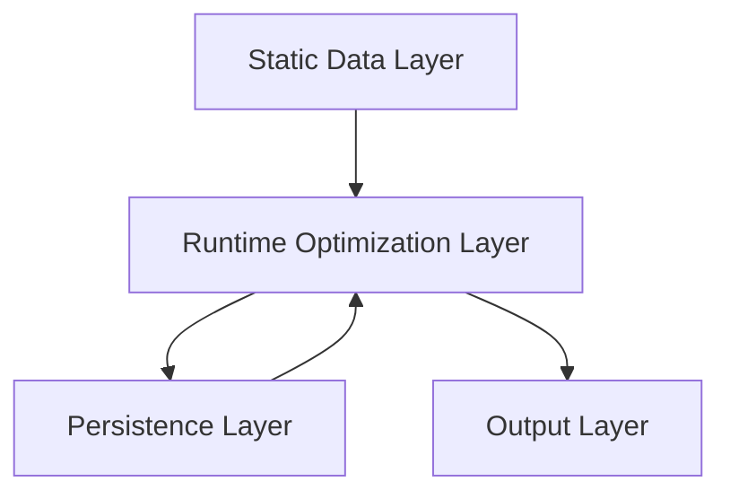

# 🔄 Voyageur Data Flow Report

**Version**: 1.0
**Date**: January 15, 2026

---

## 1. High-Level Data Lifecycle

The system transforms **User Intent** (Preferences) + **World Knowledge** (Locations) into an **Optimized Schedule**.

---

## 2. Static Data Ingress (Inputs)

Files loaded at startup:

1.  **`locations.json`**: Physical world database.
    *   *Contains*: ID, Name, Lat/Lng, Cost, Repeatable Flag.
2.  **`transport_graph.json`**: Travel physics.
    *   *Contains*: Time/Cost matrix between locations.
3.  **`family_preferences.json`**: User Constraints.
    *   *Contains*: Budgets, Interests (Tags), Must-Visit Lists.
4.  **`base_itinerary.json`**: Structural Skeleton.
    *   *Contains*: Day start/end times, Skeleton POIs (Lunch, Dinner).

---

## 3. The Runtime Loop (Day-by-Day)

For each DAY (1..N):

### Step A: Dynamic Expansion
*   **Input**: `locations.json` (Full DB), Skeleton List.
*   **Process**:
    *   Finds candidates near Skeleton POIs.
    *   Filters by family interests.
*   **Output**: `candidate_pois` (List of ~10-15 IDs).

### Step B: The Solver (Core)
*   **Input**: `candidate_pois`, `family_preferences`, `transport_graph`, **`visited_history`**.
*   **Logic**:
    *   Builds CP-SAT model.
    *   Applies constraints: Time Windows, Sync, **History Ban**.
*   **Output**: `day_result` (Optimal path for all families for THIS day).

---

## 4. The History Loop (Persistence)

Crucial for Multi-Day consistency (Step 16).

1.  **Start Trip**: `visited_history = {}`
2.  **Optimize Day 1**:
    *   Result: Fam A visits [Red Fort, Safdarjung Tomb].
3.  **Update History**: `visited_history['FAM_A'].add('LOC_001', 'LOC_010')`
4.  **Optimize Day 2**:
    *   *Input Check*: Is 'LOC_010' in `visited_history`? -> **YES**.
    *   *Constraint*: `x['LOC_010'] == 0` (BANNED).
    *   Result: Fam A visits [Humayun Tomb] instead.

---

## 5. Output Layer

**`final_optimized_trip.json`**
*   A hierarchical JSON object containing the full schedule, costs, satisfaction scores, and transport details for every family for every day.
*   Ready for frontend rendering or LLM summarization.
